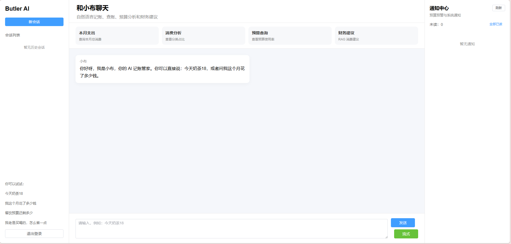

# AgentButler 项目最终复盘文档

## 1. 项目简介

AgentButler 是一个基于 Spring Boot + LangChain4j 开发的 AI 个人财务管家系统。项目的核心目标是让用户通过自然语言完成记账、查账、消费分析、预算设置、预算风险判断和财务建议获取。

系统不是简单的大模型聊天项目，而是将 AI Agent 与传统后端业务系统结合：大模型负责自然语言理解、意图识别、回复润色和知识库问答，后端负责真实数据查询、记账落库、预算计算、权限校验、消息通知和接口稳定性保障。

项目最终形成了一个包含 Redis、RabbitMQ、SSE、WebSocket、Spring Task、RAG、AOP 日志等能力的 Agent 工程化后端系统。

------

## 2. 项目定位

### 2.1 解决的问题

传统记账系统通常需要用户手动选择金额、分类、时间和备注，操作成本较高。AgentButler 希望通过自然语言降低记账门槛，例如：

```text
今天奶茶18
午饭28，打车22
今天工资到账5000
我这个月花了多少钱？
餐饮预算还剩多少？
我老是买喝的，怎么省一点？
```

系统能够自动识别用户意图，提取金额、分类、描述、收支类型等信息，并调用后端真实业务能力完成处理。

### 2.2 项目特点

本项目重点不只是“接入大模型”，而是围绕 AI Agent 做工程化落地，包括：

- 自然语言意图识别；
- 记账、查询、预算等业务 Handler 分发；
- MySQL 持久化真实业务数据；
- Redis 实现验证码、登录态、会话缓存、限流、防重复提交；
- RabbitMQ 异步处理预算预警；
- WebSocket 实时推送预算通知；
- SSE 实现 AI 流式回复；
- Spring Task 定时预算巡检；
- RAG + Embedding 实现财务知识库语义检索；
- AOP 统一记录 Agent 接口调用日志与耗时。

------

## 3. 技术栈

### 3.1 后端技术栈

- Java 17
- Spring Boot 3.x
- MyBatis-Plus
- MySQL
- Redis
- RabbitMQ
- WebSocket
- SSE
- Spring Task
- Spring AOP
- Knife4j / Springdoc OpenAPI

### 3.2 AI 技术栈

- LangChain4j
- Qwen-long ChatModel
- Qwen-long StreamingChatModel
- text-embedding-v4 EmbeddingModel
- Prompt Engineering
- RAG 检索增强生成
- MessageWindowChatMemory 窗口记忆
- MySQL + Redis 会话持久化与缓存

------

## 4. 系统整体架构

系统整体可以分为五层：

```text
前端 / Knife4j / Postman / 浏览器
        ↓
Controller 接口层
        ↓
TokenInterceptor + UserContext 鉴权层
        ↓
AgentService 核心调度层
        ↓
Handler / Service / MQ / Redis / RAG / WebSocket 业务层
        ↓
MySQL + Redis + RabbitMQ 基础设施层
```

### 4.1 核心调用链路

用户调用：

```text
POST /agent/chat
```

后端处理流程：

```text
1. TokenInterceptor 从 Authorization 中解析 token
2. Redis 根据 token 获取 userId
3. UserContext 保存当前登录用户
4. AgentService 接收 userId、sessionId、message
5. 保存用户消息到 MySQL 和 Redis
6. AgentPlanService 调用大模型解析用户意图
7. AgentIntentService 根据规则 + AI 结果裁决最终意图
8. 根据 finalIntent 分发给不同 Handler
9. Handler 调用真实业务 Service
10. 保存助手回复、动作日志、会话摘要
11. 返回 AgentChatResponse
```

------

## 5. 核心模块设计

## 5.1 统一响应与接口文档模块

项目使用统一响应结构：

```java
ResultVO<T> {
    code;
    msg;
    data;
}
```

成功返回：

```json
{
  "code": 200,
  "msg": "success",
  "data": {}
}
```

失败返回：

```json
{
  "code": -1,
  "msg": "错误信息",
  "data": null
}
```

同时集成 Knife4j，方便测试接口。由于后期引入 Token 鉴权，Knife4jConfig 中增加了全局请求头：

```text
Authorization: Bearer token
```

------

## 5.2 登录认证模块

登录采用短信验证码方式。

### 主要能力

- 发送验证码；
- Redis 存储验证码；
- Redis 实现 60 秒发送冷却；
- 验证码 5 分钟过期；
- 验证码登录；
- 手机号自动注册；
- 生成 UUID token；
- Redis 存储登录态；
- user_token 表持久化 token；
- logout 时删除 Redis token，并将数据库 token 置为失效；
- TokenInterceptor 实现统一登录校验。

### 登录链路

```text
/sms/send
↓
Redis 保存验证码 sms:code:LOGIN:{mobile}
↓
/auth/login/sms
↓
校验验证码
↓
查询或创建 app_user
↓
生成 token
↓
Redis 保存 login:token:{token} -> userId
↓
user_token 表保存 token
↓
返回 LoginResponse
```

------

## 5.3 Agent 自然语言理解模块

Agent 的核心入口是：

```text
POST /agent/chat
```

用户传入自然语言：

```json
{
  "sessionId": "session_xxx",
  "message": "今天奶茶18"
}
```

系统通过 `AgentPlanService` 调用大模型解析成结构化 JSON：

```json
{
  "intent": "RECORD_EXPENSE",
  "recordType": "EXPENSE",
  "amount": 18,
  "category": "饮品",
  "description": "奶茶",
  "expenses": [
    {
      "amount": 18,
      "category": "饮品",
      "recordType": "EXPENSE",
      "description": "奶茶"
    }
  ],
  "valid": true,
  "reason": ""
}
```

### 支持的意图类型

```text
RECORD_EXPENSE     记录收入或支出
QUERY_EXPENSE      查询消费、收入、结余
ANALYZE_EXPENSE    消费结构分析
SET_BUDGET         设置预算
BUDGET_RISK        预算查询和风险判断
LIST_RECORDS       查询账单明细
DELETE_RECORD      删除账单
UPDATE_RECORD      修改账单
UNDO_RECORD        撤销最近一笔
KNOWLEDGE_ADVICE   财务知识建议 / RAG 问答
CHAT               普通闲聊
UNKNOWN            无法识别
```

### 最终意图裁决

系统不是完全相信大模型结果，而是采用：

```text
规则优先 + AI 兜底
```

例如：

```text
“我这个月花了多少钱？”
```

可能包含数字或消费关键词，但本质是查询，所以规则优先判断为 `QUERY_EXPENSE`，避免误记账。

------

## 5.4 记账模块

### 支持能力

- 单笔支出；
- 单笔收入；
- 多笔记账；
- 自动分类；
- 描述兜底；
- recordType 标准化；
- 自动保存 sourceText 和 sessionId；
- 记账成功后发送 MQ 事件。

### 示例

用户输入：

```text
今天奶茶18
```

系统返回：

```json
{
  "reply": "好嘞，已帮你记下一笔支出：饮品18元，奶茶。",
  "actions": [
    {
      "name": "recordExpense",
      "success": true,
      "message": "支出记录已保存，记录ID：10"
    }
  ]
}
```

用户输入：

```text
今天工资到账5000
```

系统返回：

```json
{
  "reply": "好嘞，已帮你记下一笔收入：工资5000元，工资到账。",
  "actions": [
    {
      "name": "recordIncome",
      "success": true,
      "message": "收入记录已保存，记录ID：11"
    }
  ]
}
```

------

## 5.5 查询与消费分析模块

### 查询能力

系统支持按照时间范围查询：

- 今天；
- 昨天；
- 本周；
- 上周；
- 本月；
- 上月。

支持查询：

- 支出总额；
- 收入总额；
- 结余金额。

示例：

```text
我今天花了多少钱？
```

返回：

```text
你今天支出共 338.00 元。
```

示例：

```text
这个月结余多少？
```

返回：

```text
你本月收入共 5000.00 元，支出共 541.00 元，结余 4459.00 元。
```

### 消费分析能力

系统支持按照分类统计消费金额和占比。

示例：

```text
分析一下我这个月的消费情况
```

返回：

```text
你本月支出共 541.00 元。分类来看，餐饮 415.00 元，占比 76.71%；饮品 126.00 元，占比 23.29%。
```

------

## 5.6 预算管理模块

### 支持能力

- 设置总预算；
- 设置分类预算；
- 查询总预算；
- 查询分类预算；
- 预算使用率计算；
- 剩余预算计算；
- 预算风险等级判断。

### 风险等级

```text
NORMAL   正常
WARNING  接近预警线
DANGER   高风险
OVER     已超支
```

### 示例

用户输入：

```text
帮我把本月预算设置为500
```

返回：

```text
已帮你把2026-06的总预算设置为 500 元。
```

用户输入：

```text
设置餐饮预算100
```

返回：

```text
已帮你把2026-06的餐饮预算设置为 100 元。
```

用户输入：

```text
餐饮预算还剩多少？
```

返回：

```text
你2026-06的餐饮预算是 100.00 元，目前已支出 855.00 元，预算使用率为 855.00%，剩余预算 -755.00 元。已经超出预算，建议接下来控制非必要支出。
```

------

## 5.7 预算预警模块

预算预警最开始是在记账成功后同步执行，后来优化为 RabbitMQ 异步处理。

### 预警逻辑

记账成功后：

```text
1. 检查本月 TOTAL 总预算
2. 检查当前消费分类预算
3. 如果达到 WARNING / DANGER / OVER，则写入 budget_warning_log
4. 生成站内通知
5. 在线用户通过 WebSocket 实时推送
```

### 示例

用户记账：

```text
今天火锅88
```

如果预算超支，会触发：

```text
总预算超支
餐饮预算超支
```

推送消息示例：

```json
{
  "type": "BUDGET_WARNING",
  "notificationId": 1,
  "recordId": 28,
  "category": "TOTAL",
  "level": "OVER",
  "content": "另外提醒一下，你本月总预算已经超支，当前已支出 999.00 元，预算为 500.00 元。"
}
```

------

## 5.8 RabbitMQ 异步处理模块

### 使用场景

RabbitMQ 用于处理记账成功后的异步预算预警。

原同步链路：

```text
记账
↓
预算检查
↓
写预警日志
↓
返回结果
```

优化后：

```text
记账成功
↓
发送 ExpenseRecordCreatedEvent
↓
接口立即返回
↓
MQ 消费者异步检查预算
↓
生成预警日志和通知
```

### 价值

- 记账主流程和预算预警解耦；
- 避免预警逻辑影响记账接口响应速度；
- 为后续短信通知、邮件通知、报表生成提供扩展点；
- 更符合事件驱动架构。

------

## 5.9 WebSocket 实时通知模块

当 MQ 消费者触发预算预警后，系统会：

```text
1. 写入 user_notification 表
2. 判断用户是否在线
3. 如果在线，通过 WebSocket 推送
4. 如果离线，用户后续可通过通知列表查看
```

### WebSocket 连接方式

```text
ws://localhost:8181/ws/notification?token=用户token
```

握手阶段通过 token 反查 userId，并将 userId 与 WebSocketSession 绑定。

### 推送链路

```text
MQ 消费者
↓
UserNotificationService.createNotification()
↓
NotificationWebSocketHandler.sendToUser()
↓
浏览器实时收到预算预警
```

------

## 5.10 站内通知模块

WebSocket 只能解决在线推送问题，用户离线时还需要通知落库。

因此系统实现了完整的通知接口：

```text
GET /notification/list
GET /notification/unread/count
PUT /notification/{notificationId}/read
PUT /notification/read/all
```

### 通知闭环

```text
预算预警触发
↓
user_notification 落库
↓
用户在线：WebSocket 实时推送
↓
用户离线：登录后查询通知列表
↓
前端展示未读数量
↓
用户点击后标记已读
```

------

## 5.11 Redis 工程化使用

Redis 在项目中不是单点使用，而是承担了多个工程职责。

### 1. 短信验证码

```text
sms:code:{scene}:{mobile}
```

用于保存验证码，5 分钟过期。

### 2. 短信发送冷却

```text
sms:cooldown:{scene}:{mobile}
```

用于限制 60 秒内不能重复发送验证码。

### 3. 登录态 Token

```text
login:token:{token} -> userId
```

用于 TokenInterceptor 快速鉴权。

### 4. Agent 短期会话缓存

```text
agent:chat:memory:{sessionId}
```

保存最近 10 条对话，24 小时过期。

### 5. 接口限流

```text
rate:agent:chat:{userId}
```

限制用户短时间内频繁调用大模型接口。

### 6. 防重复提交

```text
dedup:agent:{hash}
```

防止用户短时间内重复点击导致重复记账。

------

## 5.12 SSE 流式输出模块

项目提供了：

```text
POST /agent/chat/stream
```

用于 AI 流式回复。

### 使用场景

SSE 主要适合：

- 普通闲聊；
- 长文本消费分析；
- 月度总结；
- AI 财务建议；
- 未来报告生成。

### 设计原则

普通记账、删除、修改等确定性业务仍然使用普通 `/agent/chat`，因为这些操作需要确保事务结果明确。SSE 更适合 AI 生成型回复。

------

## 5.13 RAG 财务知识库模块

项目先实现了关键词版 RAG，后升级为 Embedding 语义检索版 RAG。

### 表设计

```text
financial_knowledge
```

主要字段：

- title；
- content；
- category；
- tags；
- embedding。

### 检索流程

```text
用户问题
↓
识别为 KNOWLEDGE_ADVICE
↓
生成用户问题 embedding
↓
读取知识库 embedding
↓
计算余弦相似度
↓
召回 Top 3 知识
↓
将知识内容注入 Prompt
↓
AI 生成财务建议
```

### 示例

用户输入：

```text
我老是买喝的，怎么省一点？
```

系统能够语义召回：

```text
控制饮品消费的方法
```

最终返回：

```text
可以试试每周定个饮品小目标，比如只买2次、总预算50元。
买之前等24小时，常会发现其实没那么想喝。
自带水杯还能省不少。
```

### 价值

RAG 避免了大模型完全凭空回答，使财务建议可以基于本地知识库内容生成，提高可控性和可信度。

------

## 5.14 Spring Task 定时任务模块

系统实现了定时预算巡检任务。

### 功能

每天定时扫描当前月份启用中的预算配置，自动计算预算使用率，并生成预算预警日志。

### 链路

```text
每天 22:00
↓
查询本月启用预算
↓
计算 TOTAL 和分类预算使用率
↓
达到阈值则写入预警日志
```

### 使用价值

该能力可以扩展为：

- 每日消费总结；
- 月度账单报告；
- 定时预算提醒；
- 过期 token 清理；
- 过期验证码日志清理。

------

## 5.15 AOP 接口日志模块

系统使用 Spring AOP 统一记录 Agent 接口调用日志。

### 记录内容

```text
userId
sessionId
apiName
requestUri
requestMethod
requestContent
success
costMs
errorMsg
createdTime
```

### 示例记录

```text
user_id = 1
session_id = session_xxx
api_name = chat
request_uri = /agent/chat
success = 1
cost_ms = 3581
```

### 价值

AOP 日志可以用于排查：

- 哪个用户调用了 Agent；
- 哪个会话出现异常；
- 哪个接口耗时较长；
- AI 调用是否变慢；
- 用户是否频繁重复请求。

------

## 5.16 会话与记忆模块

项目实现了三层会话能力：

### 1. LangChain4j 窗口记忆

```text
MessageWindowChatMemory.withMaxMessages(10)
```

用于短期上下文理解。

### 2. MySQL 对话持久化

```text
agent_chat_message
```

保存 USER 和 ASSISTANT 消息，支持历史记录查询。

### 3. Redis 短期缓存

```text
agent:chat:memory:{sessionId}
```

保存最近 10 条会话，24 小时过期。

### 会话管理接口

```text
GET /agent/history/{sessionId}
GET /agent/sessions
DELETE /agent/session/{sessionId}
```

支持查看历史消息、查看会话列表和删除会话。

------

## 6. 数据表清单

### 用户与认证相关

```text
app_user              用户表
user_token            Token 持久化表
user_login_log        登录日志表
sms_send_log          短信发送日志表
sms_verify_log        短信校验日志表
```

### Agent 对话相关

```text
agent_chat_message    对话消息表
agent_chat_session    会话列表表
agent_action_log      Agent 动作日志表
agent_api_log         Agent 接口调用日志表
```

### 财务业务相关

```text
expense_record        收支记录表
budget                预算表
budget_warning_log    预算预警日志表
user_notification     用户站内通知表
```

### RAG 相关

```text
financial_knowledge   财务知识库表
```

------

## 7. 主要接口清单

### 登录认证

```text
POST /sms/send
POST /sms/verify
POST /auth/login/sms
POST /auth/logout
GET  /auth/me
```

### Agent 对话

```text
POST   /agent/chat
POST   /agent/chat/stream
GET    /agent/history/{sessionId}
GET    /agent/sessions
DELETE /agent/session/{sessionId}
```

### 知识库

```text
POST /knowledge/embedding/refresh
```

### 通知

```text
GET /notification/list
GET /notification/unread/count
PUT /notification/{notificationId}/read
PUT /notification/read/all
```

### WebSocket

```text
ws://localhost:8181/ws/notification?token={token}
```

------

## 8. 项目核心亮点

### 8.1 AI Agent 与真实业务系统结合

项目不是简单调用大模型，而是通过大模型解析用户自然语言，后端根据意图调用真实业务服务完成记账、查询、预算、通知等操作。

### 8.2 规则 + AI 的混合意图识别

系统没有完全依赖大模型，而是采用规则优先、AI 兜底的方式，提高了核心业务意图识别的稳定性。

### 8.3 Redis 多场景工程化落地

Redis 同时用于验证码、登录态、会话缓存、接口限流和防重复提交，体现了缓存中间件在实际系统中的多种使用方式。

### 8.4 RabbitMQ 异步预算预警

记账成功后发送 MQ 事件，由消费者异步执行预算预警逻辑，实现记账主流程与预算预警解耦。

### 8.5 WebSocket 实时通知闭环

预算预警触发后，系统将通知落库，并对在线用户进行 WebSocket 实时推送；离线用户可通过通知列表查看，形成完整通知闭环。

### 8.6 Embedding 语义检索版 RAG

系统通过 text-embedding-v4 对知识库内容进行向量化，基于余弦相似度召回相关财务知识，再由大模型生成建议。

### 8.7 SSE 流式 AI 回复

系统支持类似 ChatGPT 的流式输出能力，适合长文本回复、消费分析和财务建议生成。

### 8.8 AOP 统一日志与耗时统计

通过 AOP 统一记录 Agent 接口调用日志，便于排查慢请求、异常调用和用户操作轨迹。

------

## 9. 面试讲解版本

这个项目可以这样介绍：

AgentButler 是我开发的一个 AI 个人财务管家系统，用户可以通过自然语言完成记账、查账、消费分析、预算设置和财务建议查询。项目后端基于 Spring Boot 和 MyBatis-Plus，AI 能力使用 LangChain4j 接入大模型。

系统的核心流程是：用户输入自然语言后，大模型先将文本解析成结构化 AgentPlan，然后后端通过规则和 AI 结果共同裁决最终意图，再分发到不同 Handler 执行真实业务，比如记账、查询、预算管理、知识库问答等。

项目中我重点做了工程化能力。Redis 用于验证码、登录态、会话缓存、接口限流和防重复提交；RabbitMQ 用于记账成功后的异步预算预警；WebSocket 用于预算预警实时推送；SSE 用于 AI 流式回复；Spring Task 用于定时预算巡检；RAG 用于基于财务知识库生成消费建议；AOP 用于统一记录 Agent 接口调用日志和耗时。

这个项目的重点不是简单调用大模型，而是把 AI Agent 和传统后端业务系统结合起来，让 AI 负责理解自然语言，后端负责真实业务执行、数据持久化、权限控制和异步通知。

------

## 10. 简历写法

### 项目名称

AgentButler AI 个人财务管家系统

### 项目描述

基于 Spring Boot + LangChain4j 开发的 AI 个人财务管家系统，支持用户通过自然语言完成记账、查账、消费分析、预算设置、预算风险判断和财务建议查询。系统结合 Redis、RabbitMQ、SSE、WebSocket、Spring Task、RAG 和 AOP 等技术，实现了从自然语言理解到真实业务执行、异步预警、实时通知和知识库增强回答的完整 Agent 后端链路。

### 技术栈

Spring Boot、Java 17、MyBatis-Plus、MySQL、Redis、RabbitMQ、WebSocket、SSE、Spring Task、Spring AOP、LangChain4j、Qwen、Embedding、Knife4j

### 个人职责

- 负责 Agent 核心对话接口设计，实现自然语言输入到结构化 AgentPlan 的解析流程；
- 设计规则 + AI 的混合意图识别机制，支持记账、查询、分析、预算、账单管理和知识建议等多种意图；
- 实现收支记录、预算管理、消费统计、预算风险判断等核心业务模块；
- 使用 Redis 实现短信验证码、登录态缓存、短期会话缓存、接口限流和防重复提交；
- 引入 RabbitMQ 将记账后的预算预警处理异步化，降低主接口同步处理压力；
- 基于 WebSocket 实现预算预警实时推送，并通过通知表支持离线通知查询；
- 基于 SSE 实现 AI 流式回复，提高长文本回复体验；
- 构建财务知识库，使用 Embedding 和余弦相似度实现语义检索版 RAG；
- 使用 Spring Task 实现定时预算巡检任务；
- 使用 Spring AOP 统一记录 Agent 接口调用日志和耗时，便于问题排查和性能分析。

### 项目亮点

- 基于 LangChain4j 实现 AI Agent 自然语言理解，将用户输入解析为结构化业务指令；
- 采用规则优先 + AI 兜底的意图裁决方式，降低大模型误判对核心业务的影响；
- 使用 RabbitMQ 实现记账事件异步预算预警，完成业务解耦；
- 使用 Redis 实现验证码、登录态、会话缓存、限流和防重复提交等多场景能力；
- 基于 WebSocket + 站内通知表实现预算预警的在线实时推送和离线查询闭环；
- 基于 Embedding 实现财务知识库语义检索，提升 AI 消费建议的可控性；
- 基于 AOP 实现 Agent 接口调用日志和耗时统计，增强系统可观测性。

------

## 11. 当前不足与后续优化方向

### 11.1 意图识别仍存在复杂语义边界

目前系统通过规则 + Prompt 约束提升了稳定性，但对于复杂反问、上下文省略、多意图混合表达，仍可能出现误判。

后续可以优化为：

```text
RouterAgent
↓
IntentClassifier
↓
Tool Calling
↓
业务 Handler
```

或者训练轻量分类模型辅助意图识别。

### 11.2 MQ 可靠性机制尚未完全生产化

当前 MQ 已实现异步预算预警，但生产环境还可以继续完善：

- ConfirmCallback；
- ReturnCallback；
- 手动 ACK；
- 死信队列；
- 消费幂等；
- 失败重试；
- 消息补偿。

### 11.3 RAG 目前是轻量向量检索

当前向量存储在 MySQL 的 LONGTEXT 字段中，适合项目学习和小规模数据。

后续可以升级为：

- Milvus；
- Elasticsearch Vector；
- pgvector；
- Redis Vector。

### 11.4 WebSocket 当前是单机内存 Session 管理

目前 WebSocketSession 保存在本地 Map 中，适合单机项目。

如果后续部署多实例，可以升级为：

- Redis Pub/Sub；
- MQ 广播；
- Gateway 统一连接层；
- 分布式在线用户管理。

### 11.5 家庭财务 Agent 可作为后续扩展

后续可以支持多用户家庭账本：

```text
用户 A
用户 B
↓
加入同一个家庭空间
↓
共享家庭账本和家庭预算
↓
Agent 根据个人 / 家庭上下文查询不同数据
```

可以扩展为：

- PersonalFinanceAgent；
- FamilyFinanceAgent；
- RouterAgent。

------

## 12. 项目总结

AgentButler 从最初的自然语言记账 Demo，逐步演进为一个具备完整工程化能力的 AI 财务管家系统。

项目最终实现了：

```text
自然语言输入
↓
大模型解析意图
↓
规则 + AI 裁决
↓
业务 Handler 执行
↓
MySQL 持久化
↓
Redis 缓存与限流
↓
RabbitMQ 异步预警
↓
WebSocket 实时通知
↓
RAG 财务建议
↓
SSE 流式回复
↓
AOP 日志监控
```

这个项目的核心价值在于：它不是单纯的大模型聊天，而是将 AI Agent 融入真实后端系统，用工程化方式解决认证、会话、缓存、异步、通知、知识库和日志等问题，体现了 AI 应用从 Demo 到可维护系统的完整开发思路。
