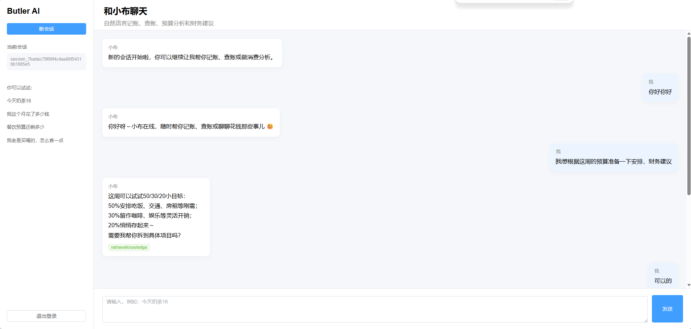

# 项目创建

## 1.创建vue3项目

```
cd E:\IDEAProjects
npm create vite@latest butler-agent-web -- --template vue
cd butler-agent-web
npm install
```

```
npm install element-plus axios vue-router@4 @element-plus/icons-vue
```

```
npm run dev
```

## 2.修改 vite.config.js

用代理转发到你的后端 `8181`，这样前端请求 `/api/agent/chat` 会自动转到 `http://localhost:8181/agent/chat`。

```java
import { defineConfig } from 'vite'
import vue from '@vitejs/plugin-vue'

export default defineConfig({
  plugins: [vue()],
  server: {
    port: 5173,
    proxy: {
      '/api': {
        target: 'http://localhost:8181',
        changeOrigin: true,
        rewrite: path => path.replace(/^\/api/, '')
      }
    }
  }
})
```

------

## 3. 修改 src/main.js

```
import { createApp } from 'vue'
import ElementPlus from 'element-plus'
import 'element-plus/dist/index.css'

import App from './App.vue'
import router from './router'

const app = createApp(App)

app.use(ElementPlus)
app.use(router)

app.mount('#app')
```

------

## 4. 新建路由 src/router/index.js

先创建文件夹：

```
src/router/index.js
```

代码：

```
import { createRouter, createWebHistory } from 'vue-router'

import Login from '../views/Login.vue'
import Chat from '../views/Chat.vue'

const routes = [
  {
    path: '/',
    redirect: '/chat'
  },
  {
    path: '/login',
    component: Login
  },
  {
    path: '/chat',
    component: Chat
  }
]

const router = createRouter({
  history: createWebHistory(),
  routes
})

router.beforeEach((to, from, next) => {
  const token = localStorage.getItem('butler_token')

  if (to.path !== '/login' && !token) {
    next('/login')
    return
  }

  next()
})

export default router
```

------

## 5. 新建请求工具 src/utils/request.js

```
import axios from 'axios'
import { ElMessage } from 'element-plus'
import router from '../router'

const request = axios.create({
  baseURL: '/api',
  timeout: 60000
})

request.interceptors.request.use(config => {
  const token = localStorage.getItem('butler_token')

  if (token) {
    config.headers.Authorization = `Bearer ${token}`
  }

  return config
})

request.interceptors.response.use(
  response => {
    const res = response.data

    if (res.code === 200) {
      return res.data
    }

    if (res.code === 401) {
      ElMessage.error(res.msg || '登录已过期')
      localStorage.removeItem('butler_token')
      router.push('/login')
      return Promise.reject(res)
    }

    ElMessage.error(res.msg || '请求失败')
    return Promise.reject(res)
  },
  error => {
    ElMessage.error(error.message || '网络异常')
    return Promise.reject(error)
  }
)

export default request
```

------

## 6. 新建接口文件 src/api/auth.js

```
import request from '../utils/request'

export function sendSmsCode(data) {
  return request({
    url: '/sms/send',
    method: 'post',
    data
  })
}

export function loginBySms(data) {
  return request({
    url: '/auth/login/sms',
    method: 'post',
    data
  })
}

export function getCurrentUser() {
  return request({
    url: '/auth/me',
    method: 'get'
  })
}

export function logout() {
  return request({
    url: '/auth/logout',
    method: 'post'
  })
}
```

------

## 7. 新建接口文件 src/api/agent.js

```
import request from '../utils/request'

export function chat(data) {
  return request({
    url: '/agent/chat',
    method: 'post',
    data
  })
}

export function listSessions() {
  return request({
    url: '/agent/sessions',
    method: 'get'
  })
}

export function getHistory(sessionId) {
  return request({
    url: `/agent/history/${sessionId}`,
    method: 'get'
  })
}
```

------

## 8. 修改 src/App.vue

```
<template>
  <router-view />
</template>

<script setup>
</script>

<style>
html,
body,
#app {
  margin: 0;
  width: 100%;
  height: 100%;
  font-family: Arial, "Microsoft YaHei", sans-serif;
}
</style>
```

------

## 9. 新建登录页 src/views/Login.vue

```
<template>
  <div class="login-page">
    <div class="login-card">
      <h2>Butler AI 个人财务管家</h2>
      <p class="subtitle">手机号验证码登录</p>

      <el-form label-position="top">
        <el-form-item label="手机号">
          <el-input
            v-model="mobile"
            placeholder="请输入手机号"
            maxlength="11"
          />
        </el-form-item>

        <el-form-item label="验证码">
          <div class="code-row">
            <el-input
              v-model="code"
              placeholder="请输入验证码"
            />
            <el-button
              :disabled="countdown > 0"
              @click="handleSendCode"
            >
              {{ countdown > 0 ? countdown + 's' : '发送验证码' }}
            </el-button>
          </div>
        </el-form-item>

        <el-button
          type="primary"
          class="login-button"
          :loading="loading"
          @click="handleLogin"
        >
          登录
        </el-button>
      </el-form>
    </div>
  </div>
</template>

<script setup>
import { ref } from 'vue'
import { ElMessage } from 'element-plus'
import { useRouter } from 'vue-router'
import { sendSmsCode, loginBySms } from '../api/auth'

const router = useRouter()

const mobile = ref('13300000000')
const code = ref('')
const loading = ref(false)
const countdown = ref(0)

let timer = null

const handleSendCode = async () => {
  if (!mobile.value) {
    ElMessage.warning('请输入手机号')
    return
  }

  await sendSmsCode({
    mobile: mobile.value,
    scene: 'LOGIN'
  })

  ElMessage.success('验证码已发送，请查看后端控制台')

  countdown.value = 60
  timer = setInterval(() => {
    countdown.value--

    if (countdown.value <= 0) {
      clearInterval(timer)
    }
  }, 1000)
}

const handleLogin = async () => {
  if (!mobile.value || !code.value) {
    ElMessage.warning('请输入手机号和验证码')
    return
  }

  loading.value = true

  try {
    const res = await loginBySms({
      mobile: mobile.value,
      scene: 'LOGIN',
      code: code.value
    })

    localStorage.setItem('butler_token', res.token)
    localStorage.setItem('butler_user_id', res.userId)
    localStorage.setItem('butler_mobile', res.mobile)

    ElMessage.success('登录成功')
    router.push('/chat')
  } finally {
    loading.value = false
  }
}
</script>

<style scoped>
.login-page {
  height: 100vh;
  background: #f5f7fb;
  display: flex;
  align-items: center;
  justify-content: center;
}

.login-card {
  width: 380px;
  padding: 32px;
  border-radius: 12px;
  background: #ffffff;
  box-shadow: 0 8px 30px rgba(0, 0, 0, 0.08);
}

.login-card h2 {
  margin: 0;
  text-align: center;
}

.subtitle {
  text-align: center;
  color: #888;
  margin-bottom: 28px;
}

.code-row {
  display: flex;
  gap: 10px;
  width: 100%;
}

.login-button {
  width: 100%;
  margin-top: 10px;
}
</style>
```

------

## 10. 新建聊天页 src/views/Chat.vue

```
<template>
  <div class="chat-page">
    <div class="sidebar">
      <div class="logo">Butler AI</div>

      <el-button type="primary" class="new-chat" @click="newChat">
        新会话
      </el-button>

      <div class="session-title">当前会话</div>
      <div class="session-id">
        {{ sessionId || '未创建' }}
      </div>

      <div class="tips">
        <p>你可以试试：</p>
        <p>今天奶茶18</p>
        <p>我这个月花了多少钱</p>
        <p>餐饮预算还剩多少</p>
        <p>我老是买喝的，怎么省一点</p>
      </div>

      <el-button class="logout" @click="handleLogout">
        退出登录
      </el-button>
    </div>

    <div class="main">
      <div class="header">
        <div>
          <h2>和小布聊天</h2>
          <p>自然语言记账、查账、预算分析和财务建议</p>
        </div>
      </div>

      <div class="messages" ref="messageBoxRef">
        <div
          v-for="(item, index) in messages"
          :key="index"
          class="message-row"
          :class="item.role"
        >
          <div class="bubble">
            <div class="role">
              {{ item.role === 'user' ? '我' : '小布' }}
            </div>
            <div class="content">
              {{ item.content }}
            </div>

            <div
              v-if="item.actions && item.actions.length"
              class="actions"
            >
              <el-tag
                v-for="(action, idx) in item.actions"
                :key="idx"
                size="small"
                type="success"
              >
                {{ action.name }}
              </el-tag>
            </div>
          </div>
        </div>
      </div>

      <div class="input-area">
        <el-input
          v-model="inputMessage"
          type="textarea"
          :rows="3"
          placeholder="请输入，例如：今天奶茶18"
          @keydown.enter.exact.prevent="handleSend"
        />

        <el-button
          type="primary"
          class="send-button"
          :loading="sending"
          @click="handleSend"
        >
          发送
        </el-button>
      </div>
    </div>
  </div>
</template>

<script setup>
import { nextTick, ref } from 'vue'
import { ElMessage, ElMessageBox } from 'element-plus'
import { useRouter } from 'vue-router'
import { chat } from '../api/agent'
import { logout } from '../api/auth'

const router = useRouter()

const sessionId = ref('')
const inputMessage = ref('')
const sending = ref(false)
const messageBoxRef = ref(null)

const messages = ref([
  {
    role: 'assistant',
    content: '你好呀，我是小布，你的 AI 记账管家。你可以直接说：今天奶茶18，或者问我这个月花了多少钱。',
    actions: []
  }
])

const newChat = () => {
  sessionId.value = ''
  messages.value = [
    {
      role: 'assistant',
      content: '新的会话开始啦，你可以继续让我帮你记账、查账或做消费分析。',
      actions: []
    }
  ]
}

const scrollToBottom = async () => {
  await nextTick()

  if (messageBoxRef.value) {
    messageBoxRef.value.scrollTop = messageBoxRef.value.scrollHeight
  }
}

const handleSend = async () => {
  const text = inputMessage.value.trim()

  if (!text) {
    ElMessage.warning('请输入内容')
    return
  }

  messages.value.push({
    role: 'user',
    content: text,
    actions: []
  })

  inputMessage.value = ''
  sending.value = true

  await scrollToBottom()

  try {
    const res = await chat({
      sessionId: sessionId.value,
      message: text
    })

    sessionId.value = res.sessionId

    messages.value.push({
      role: 'assistant',
      content: res.reply,
      actions: res.actions || []
    })

    await scrollToBottom()
  } finally {
    sending.value = false
  }
}

const handleLogout = async () => {
  await ElMessageBox.confirm('确定要退出登录吗？', '提示', {
    type: 'warning'
  })

  try {
    await logout()
  } catch (e) {
    // 即使后端退出失败，也清理本地 token
  }

  localStorage.removeItem('butler_token')
  localStorage.removeItem('butler_user_id')
  localStorage.removeItem('butler_mobile')

  router.push('/login')
}
</script>

<style scoped>
.chat-page {
  height: 100vh;
  display: flex;
  background: #f5f7fb;
}

.sidebar {
  width: 260px;
  background: #ffffff;
  border-right: 1px solid #e8e8e8;
  padding: 20px;
  box-sizing: border-box;
  display: flex;
  flex-direction: column;
}

.logo {
  font-size: 22px;
  font-weight: bold;
  margin-bottom: 20px;
}

.new-chat {
  width: 100%;
  margin-bottom: 24px;
}

.session-title {
  font-size: 14px;
  color: #666;
  margin-bottom: 8px;
}

.session-id {
  font-size: 12px;
  color: #999;
  word-break: break-all;
  background: #f5f7fb;
  padding: 10px;
  border-radius: 6px;
}

.tips {
  margin-top: 24px;
  font-size: 13px;
  color: #666;
  line-height: 1.8;
}

.logout {
  margin-top: auto;
}

.main {
  flex: 1;
  display: flex;
  flex-direction: column;
}

.header {
  height: 86px;
  background: #ffffff;
  border-bottom: 1px solid #e8e8e8;
  padding: 16px 28px;
  box-sizing: border-box;
}

.header h2 {
  margin: 0 0 8px 0;
}

.header p {
  margin: 0;
  color: #888;
}

.messages {
  flex: 1;
  overflow-y: auto;
  padding: 24px;
}

.message-row {
  display: flex;
  margin-bottom: 18px;
}

.message-row.user {
  justify-content: flex-end;
}

.message-row.assistant {
  justify-content: flex-start;
}

.bubble {
  max-width: 620px;
  background: #ffffff;
  padding: 14px 16px;
  border-radius: 10px;
  box-shadow: 0 4px 16px rgba(0, 0, 0, 0.04);
}

.message-row.user .bubble {
  background: #ecf5ff;
}

.role {
  font-size: 13px;
  color: #888;
  margin-bottom: 6px;
}

.content {
  white-space: pre-wrap;
  line-height: 1.7;
}

.actions {
  margin-top: 10px;
  display: flex;
  gap: 6px;
  flex-wrap: wrap;
}

.input-area {
  background: #ffffff;
  border-top: 1px solid #e8e8e8;
  padding: 18px 24px;
  display: flex;
  gap: 12px;
  align-items: flex-end;
}

.send-button {
  width: 90px;
  height: 76px;
}
</style>
```

> 测试
>
> ```
> npm run dev
> ```
>
> 
>
> 问题：
>
> **左侧会话显示的是 sessionId，不适合展示**
>
> **用户说“可以的”后，小布返回了 JSON，这是后端 AI 记忆污染问题**

### 优化

####  Chat.vue

```html
<template>
  <div class="chat-page">
    <div class="sidebar">
      <div class="logo">Butler AI</div>

      <el-button type="primary" class="new-chat" @click="newChat">
        新会话
      </el-button>

      <div class="session-title">当前会话</div>
      <div class="session-id" :title="sessionId || '未创建'">
        {{ currentSessionTitle }}
      </div>

      <div class="tips">
        <p>你可以试试：</p>
        <p>今天奶茶18</p>
        <p>我这个月花了多少钱</p>
        <p>餐饮预算还剩多少</p>
        <p>我老是买喝的，怎么省一点</p>
      </div>

      <el-button class="logout" @click="handleLogout">
        退出登录
      </el-button>
    </div>

    <div class="main">
      <div class="header">
        <div>
          <h2>和小布聊天</h2>
          <p>自然语言记账、查账、预算分析和财务建议</p>
        </div>
      </div>

      <div class="messages" ref="messageBoxRef">
        <div
            v-for="(item, index) in messages"
            :key="index"
            class="message-row"
            :class="item.role"
        >
          <div class="bubble">
            <div class="role">
              {{ item.role === 'user' ? '我' : '小布' }}
            </div>
            <div class="content">
              {{ item.content }}
            </div>

            <div
                v-if="item.actions && item.actions.length"
                class="actions"
            >
              <el-tag
                  v-for="(action, idx) in item.actions"
                  :key="idx"
                  size="small"
                  type="success"
              >
                {{ action.name }}
              </el-tag>
            </div>
          </div>
        </div>
      </div>

      <div class="input-area">
        <el-input
            v-model="inputMessage"
            type="textarea"
            :rows="3"
            placeholder="请输入，例如：今天奶茶18"
            @keydown.enter.exact.prevent="handleSend"
        />

        <el-button
            type="primary"
            class="send-button"
            :loading="sending"
            @click="handleSend"
        >
          发送
        </el-button>
      </div>
    </div>
  </div>
</template>

<script setup>
import { nextTick, ref } from 'vue'
import { ElMessage, ElMessageBox } from 'element-plus'
import { useRouter } from 'vue-router'
import { chat } from '../api/agent'
import { logout } from '../api/auth'

const router = useRouter()

const sessionId = ref('')
const currentSessionTitle = ref('新会话')
const inputMessage = ref('')
const sending = ref(false)
const messageBoxRef = ref(null)

const messages = ref([
  {
    role: 'assistant',
    content: '你好呀，我是小布，你的 AI 记账管家。你可以直接说：今天奶茶18，或者问我这个月花了多少钱。',
    actions: []
  }
])

const newChat = () => {
  sessionId.value = ''
  currentSessionTitle.value = '新会话'

  messages.value = [
    {
      role: 'assistant',
      content: '新的会话开始啦，你可以继续让我帮你记账、查账或做消费分析。',
      actions: []
    }
  ]
}

const scrollToBottom = async () => {
  await nextTick()

  if (messageBoxRef.value) {
    messageBoxRef.value.scrollTop = messageBoxRef.value.scrollHeight
  }
}

const handleSend = async () => {
  const text = inputMessage.value.trim()

  if (!text) {
    ElMessage.warning('请输入内容')
    return
  }

  const isNewSession = !sessionId.value

  messages.value.push({
    role: 'user',
    content: text,
    actions: []
  })

  inputMessage.value = ''
  sending.value = true

  await scrollToBottom()

  try {
    const res = await chat({
      sessionId: sessionId.value,
      message: text
    })

    sessionId.value = res.sessionId

    if (isNewSession) {
      currentSessionTitle.value = buildTitle(text)
    }

    messages.value.push({
      role: 'assistant',
      content: res.reply,
      actions: res.actions || []
    })

    await scrollToBottom()
  } finally {
    sending.value = false
  }
}
const buildTitle = (text) => {
  if (!text) {
    return '新会话'
  }

  return text.length > 12 ? text.substring(0, 12) + '...' : text
}
const handleLogout = async () => {
  await ElMessageBox.confirm('确定要退出登录吗？', '提示', {
    type: 'warning'
  })

  try {
    await logout()
  } catch (e) {
    // 即使后端退出失败，也清理本地 token
  }

  localStorage.removeItem('butler_token')
  localStorage.removeItem('butler_user_id')
  localStorage.removeItem('butler_mobile')

  router.push('/login')
}
</script>

<style scoped>
.chat-page {
  height: 100vh;
  display: flex;
  background: #f5f7fb;
}

.sidebar {
  width: 260px;
  background: #ffffff;
  border-right: 1px solid #e8e8e8;
  padding: 20px;
  box-sizing: border-box;
  display: flex;
  flex-direction: column;
}

.logo {
  font-size: 22px;
  font-weight: bold;
  margin-bottom: 20px;
}

.new-chat {
  width: 100%;
  margin-bottom: 24px;
}

.session-title {
  font-size: 14px;
  color: #666;
  margin-bottom: 8px;
}

.session-id {
  font-size: 12px;
  color: #999;
  word-break: break-all;
  background: #f5f7fb;
  padding: 10px;
  border-radius: 6px;
}

.tips {
  margin-top: 24px;
  font-size: 13px;
  color: #666;
  line-height: 1.8;
}

.logout {
  margin-top: auto;
}

.main {
  flex: 1;
  display: flex;
  flex-direction: column;
}

.header {
  height: 86px;
  background: #ffffff;
  border-bottom: 1px solid #e8e8e8;
  padding: 16px 28px;
  box-sizing: border-box;
}

.header h2 {
  margin: 0 0 8px 0;
}

.header p {
  margin: 0;
  color: #888;
}

.messages {
  flex: 1;
  overflow-y: auto;
  padding: 24px;
}

.message-row {
  display: flex;
  margin-bottom: 18px;
}

.message-row.user {
  justify-content: flex-end;
}

.message-row.assistant {
  justify-content: flex-start;
}

.bubble {
  max-width: 620px;
  background: #ffffff;
  padding: 14px 16px;
  border-radius: 10px;
  box-shadow: 0 4px 16px rgba(0, 0, 0, 0.04);
}

.message-row.user .bubble {
  background: #ecf5ff;
}

.role {
  font-size: 13px;
  color: #888;
  margin-bottom: 6px;
}

.content {
  white-space: pre-wrap;
  line-height: 1.7;
}

.actions {
  margin-top: 10px;
  display: flex;
  gap: 6px;
  flex-wrap: wrap;
}

.input-area {
  background: #ffffff;
  border-top: 1px solid #e8e8e8;
  padding: 18px 24px;
  display: flex;
  gap: 12px;
  align-items: flex-end;
}

.send-button {
  width: 90px;
  height: 76px;
}
</style>
```


#### AgentPlanServiceImpl

```java
package com.test.service.impl;

import com.fasterxml.jackson.databind.ObjectMapper;
import com.test.dto.AgentPlan;
import com.test.service.AIService;
import com.test.service.AgentPlanService;
import org.springframework.beans.factory.annotation.Autowired;
import org.springframework.stereotype.Service;

@Service
public class AgentPlanServiceImpl implements AgentPlanService {

    @Autowired
    private AIService aiService;

    @Autowired
    private ObjectMapper objectMapper;

    @Override
    public AgentPlan parsePlan(String sessionId, String message) {
        try {
            String planMemoryId = "plan_" + java.util.UUID.randomUUID().toString().replace("-", "");

            String json = aiService.plan(planMemoryId, message);
            
            System.out.println("AI Agent 计划结果：" + json);
            json = cleanJson(json);
            return this.objectMapper.readValue(json, AgentPlan.class);
        } catch (Exception e) {
            AgentPlan plan = new AgentPlan();
            plan.setIntent(null);
            plan.setValid(false);
            plan.setReason("AI解析失败：" + e.getMessage());
            return plan;
        }
    }

    private String cleanJson(String json) {
        if (json == null) {
            return "{}";
        }

        json = json.trim();
        json = json.replace("```json", "");
        json = json.replace("```", "");
        json = json.trim();

        int start = json.indexOf("{");
        int end = json.lastIndexOf("}");

        if (start >= 0 && end >= 0 && end > start) {
            return json.substring(start, end + 1);
        }

        return json;
    }
}
```

#### AgentChatReplyService

```java
package com.test.service.impl;

import com.test.dto.AgentAction;
import com.test.dto.AgentChatResponse;
import com.test.service.AIService;
import org.springframework.beans.factory.annotation.Autowired;
import org.springframework.stereotype.Service;

import java.util.List;

@Service
public class AgentChatReplyService {

    @Autowired
    private AIService aiService;

    public AgentChatResponse chat(String sessionId,
                                  String message,
                                  List<AgentAction> actions) {

        AgentChatResponse response = new AgentChatResponse();

        try {
            String reply = aiService.chat("chat_" + sessionId, message);
            
            response.setReply(reply);
            response.setActions(actions);

            return response;
        } catch (Exception e) {
//            e.printStackTrace();
            response.setReply("刚有点走神了，你可以再说一遍吗？");
            response.setActions(actions);
            return response;
        }
    }
}
```


#### AgentKnowledgeHandler

```java
package com.test.service.impl;

import com.test.dto.AgentAction;
import com.test.dto.AgentChatResponse;
import com.test.entity.FinancialKnowledge;
import com.test.service.AIService;
import com.test.service.FinancialKnowledgeService;
import org.springframework.beans.factory.annotation.Autowired;
import org.springframework.stereotype.Service;

import java.util.List;

@Service
public class AgentKnowledgeHandler {

    @Autowired
    private FinancialKnowledgeService financialKnowledgeService;

    @Autowired
    private AIService aiService;

    public AgentChatResponse handle(Long userId,
                                    String sessionId,
                                    String message,
                                    List<AgentAction> actions) {

        AgentChatResponse response = new AgentChatResponse();

        List<FinancialKnowledge> knowledgeList =
                financialKnowledgeService.semanticSearchKnowledge(message, 3);

        if (knowledgeList == null || knowledgeList.isEmpty()) {
            response.setReply("我暂时没有检索到相关财务知识，不过你可以换个说法，例如：怎么控制奶茶消费？");
            response.setActions(actions);
            return response;
        }

        StringBuilder knowledgeText = new StringBuilder();

        for (int i = 0; i < knowledgeList.size(); i++) {
            FinancialKnowledge knowledge = knowledgeList.get(i);

            knowledgeText.append(i + 1)
                    .append(". ")
                    .append(knowledge.getTitle());

            if (knowledge.getScore() != null) {
                knowledgeText.append("（相似度：")
                        .append(String.format("%.4f", knowledge.getScore()))
                        .append("）");
            }

            knowledgeText.append("：")
                    .append(knowledge.getContent())
                    .append("\n");
        }

        String prompt = "你是一个 AI 个人财务管家，请基于下面检索到的财务知识回答用户问题。\n"
                + "要求：\n"
                + "1. 回答要自然，不要机械复制知识库原文。\n"
                + "2. 建议要具体、可执行。\n"
                + "3. 不要编造知识库中没有依据的专业结论。\n"
                + "4. 可以结合用户的问题做适当解释。\n\n"
                + "【检索到的知识】\n"
                + knowledgeText
                + "\n【用户问题】\n"
                + message;

        String reply = aiService.chat("chat_" + sessionId, prompt);

        AgentAction action = new AgentAction();
        action.setName("retrieveKnowledge");
        action.setSuccess(true);
        action.setMessage("知识库检索成功，共检索到 " + knowledgeList.size() + " 条知识");

        actions.add(action);

        response.setReply(reply);
        response.setActions(actions);

        return response;
    }
}
```

#### AgentStreamService

```java
package com.test.service.impl;

import com.test.service.AIService;
import com.test.service.AgentChatMessageService;
import com.test.service.AgentChatSessionService;
import com.test.service.AgentMemoryCacheService;
import org.springframework.beans.factory.annotation.Autowired;
import org.springframework.stereotype.Service;
import org.springframework.web.servlet.mvc.method.annotation.SseEmitter;

import java.io.IOException;
import java.util.UUID;

@Service
public class AgentStreamService {

    @Autowired
    private AIService aiService;

    @Autowired
    private AgentChatMessageService agentChatMessageService;

    @Autowired
    private AgentMemoryCacheService agentMemoryCacheService;

    @Autowired
    private AgentChatSessionService agentChatSessionService;

    public SseEmitter streamChat(Long userId,
                                 String sessionId,
                                 String message) {

        if (sessionId == null || sessionId.trim().isEmpty()) {
            sessionId = "session_" + UUID.randomUUID().toString().replace("-", "");
        }

        String finalSessionId = sessionId;

        SseEmitter emitter = new SseEmitter(60_000L);

        StringBuilder fullReply = new StringBuilder();

        try {
            // 1. 先把 sessionId 返回给前端
            emitter.send(SseEmitter.event()
                    .name("session")
                    .data(finalSessionId));

            // 2. 保存用户消息到 MySQL
            agentChatMessageService.saveMessage(
                    userId,
                    finalSessionId,
                    "USER",
                    message,
                    null,
                    "CHAT_STREAM"
            );

            // 3. 保存用户消息到 Redis
            agentMemoryCacheService.appendMessage(
                    finalSessionId,
                    "USER",
                    message
            );

            // 4. 调用流式 AI
            aiService.streamChat("chat_" + finalSessionId, message)
                    .onPartialResponse(partialResponse -> {
                        try {
                            fullReply.append(partialResponse);

                            emitter.send(SseEmitter.event()
                                    .name("message")
                                    .data(partialResponse));

                        } catch (IOException e) {
                            emitter.completeWithError(e);
                        }
                    })
                    .onCompleteResponse(chatResponse -> {
                        try {
                            String reply = fullReply.toString();

                            // 5. 保存助手回复到 MySQL
                            agentChatMessageService.saveMessage(
                                    userId,
                                    finalSessionId,
                                    "ASSISTANT",
                                    reply,
                                    "CHAT",
                                    "CHAT_STREAM"
                            );

                            // 6. 保存助手回复到 Redis
                            agentMemoryCacheService.appendMessage(
                                    finalSessionId,
                                    "ASSISTANT",
                                    reply
                            );

                            // 7. 更新会话列表
                            agentChatSessionService.createOrUpdateSession(
                                    userId,
                                    finalSessionId,
                                    message,
                                    reply
                            );

                            emitter.send(SseEmitter.event()
                                    .name("done")
                                    .data("[DONE]"));

                            emitter.complete();

                        } catch (IOException e) {
                            emitter.completeWithError(e);
                        }
                    })
                    .onError(throwable -> {
                        try {
                            emitter.send(SseEmitter.event()
                                    .name("error")
                                    .data("流式回复失败：" + throwable.getMessage()));
                        } catch (IOException ignored) {
                        }

                        emitter.complete();
                    })
                    .start();

        } catch (Exception e) {
            try {
                emitter.send(SseEmitter.event()
                        .name("error")
                        .data("流式接口异常：" + e.getMessage()));
            } catch (IOException ignored) {
            }

            emitter.complete();
        }

        return emitter;
    }
}
```


> 测试
>
> ```
> 
> ```
>
> 


## 11.websocket预算预警弹窗

### notificationSocket.js

```
import { ElNotification } from 'element-plus'

let socket = null
let reconnectTimer = null
let manualClose = false

export function connectNotificationSocket() {
  const token = localStorage.getItem('butler_token')

  if (!token) {
    return
  }

  if (socket && socket.readyState === WebSocket.OPEN) {
    return
  }

  manualClose = false

  const wsUrl = `ws://localhost:8181/ws/notification?token=${token}`

  socket = new WebSocket(wsUrl)

  socket.onopen = () => {
    console.log('WebSocket 通知连接成功')
  }

  socket.onmessage = (event) => {
    console.log('收到 WebSocket 通知：', event.data)

    try {
      const data = JSON.parse(event.data)

      if (data.type === 'BUDGET_WARNING') {
        ElNotification({
          title: '预算预警',
          message: data.content || '你的预算状态发生变化',
          type: data.level === 'OVER' ? 'error' : 'warning',
          duration: 6000
        })

        return
      }

      ElNotification({
        title: '系统通知',
        message: data.content || event.data,
        type: 'info',
        duration: 5000
      })
    } catch (e) {
      ElNotification({
        title: '系统通知',
        message: event.data,
        type: 'info',
        duration: 5000
      })
    }
  }

  socket.onerror = () => {
    console.log('WebSocket 通知连接异常')
  }

  socket.onclose = () => {
    console.log('WebSocket 通知连接关闭')

    if (!manualClose) {
      reconnectTimer = setTimeout(() => {
        connectNotificationSocket()
      }, 3000)
    }
  }
}

export function closeNotificationSocket() {
  manualClose = true

  if (reconnectTimer) {
    clearTimeout(reconnectTimer)
    reconnectTimer = null
  }

  if (socket) {
    socket.close()
    socket = null
  }
}
```

### Chat.vue

```
<template>
  <div class="chat-page">
    <div class="sidebar">
      <div class="logo">Butler AI</div>

      <el-button type="primary" class="new-chat" @click="newChat">
        新会话
      </el-button>

      <div class="session-title">当前会话</div>
      <div class="session-id" :title="sessionId || '未创建'">
        {{ currentSessionTitle }}
      </div>

      <div class="tips">
        <p>你可以试试：</p>
        <p>今天奶茶18</p>
        <p>我这个月花了多少钱</p>
        <p>餐饮预算还剩多少</p>
        <p>我老是买喝的，怎么省一点</p>
      </div>

      <el-button class="logout" @click="handleLogout">
        退出登录
      </el-button>
    </div>

    <div class="main">
      <div class="header">
        <div>
          <h2>和小布聊天</h2>
          <p>自然语言记账、查账、预算分析和财务建议</p>
        </div>
      </div>

      <div class="messages" ref="messageBoxRef">
        <div
            v-for="(item, index) in messages"
            :key="index"
            class="message-row"
            :class="item.role"
        >
          <div class="bubble">
            <div class="role">
              {{ item.role === 'user' ? '我' : '小布' }}
            </div>
            <div class="content">
              {{ item.content }}
            </div>

            <div
                v-if="item.actions && item.actions.length"
                class="actions"
            >
              <el-tag
                  v-for="(action, idx) in item.actions"
                  :key="idx"
                  size="small"
                  type="success"
              >
                {{ action.name }}
              </el-tag>
            </div>
          </div>
        </div>
      </div>

      <div class="input-area">
        <el-input
            v-model="inputMessage"
            type="textarea"
            :rows="3"
            placeholder="请输入，例如：今天奶茶18"
            @keydown.enter.exact.prevent="handleSend"
        />

        <el-button
            type="primary"
            class="send-button"
            :loading="sending"
            @click="handleSend"
        >
          发送
        </el-button>
      </div>
    </div>
  </div>
</template>

<script setup>
import { nextTick, onMounted, onBeforeUnmount, ref } from 'vue'
import {
  connectNotificationSocket,
  closeNotificationSocket
} from '../utils/notificationSocket'
import { ElMessage, ElMessageBox } from 'element-plus'
import { useRouter } from 'vue-router'
import { chat } from '../api/agent'
import { logout } from '../api/auth'

const router = useRouter()

const sessionId = ref('')
const currentSessionTitle = ref('新会话')
const inputMessage = ref('')
const sending = ref(false)
const messageBoxRef = ref(null)

const messages = ref([
  {
    role: 'assistant',
    content: '你好呀，我是小布，你的 AI 记账管家。你可以直接说：今天奶茶18，或者问我这个月花了多少钱。',
    actions: []
  }
])

const newChat = () => {
  sessionId.value = ''
  currentSessionTitle.value = '新会话'

  messages.value = [
    {
      role: 'assistant',
      content: '新的会话开始啦，你可以继续让我帮你记账、查账或做消费分析。',
      actions: []
    }
  ]
}

const scrollToBottom = async () => {
  await nextTick()

  if (messageBoxRef.value) {
    messageBoxRef.value.scrollTop = messageBoxRef.value.scrollHeight
  }
}

const handleSend = async () => {
  const text = inputMessage.value.trim()

  if (!text) {
    ElMessage.warning('请输入内容')
    return
  }

  const isNewSession = !sessionId.value

  messages.value.push({
    role: 'user',
    content: text,
    actions: []
  })

  inputMessage.value = ''
  sending.value = true

  await scrollToBottom()

  try {
    const res = await chat({
      sessionId: sessionId.value,
      message: text
    })

    sessionId.value = res.sessionId

    if (isNewSession) {
      currentSessionTitle.value = buildTitle(text)
    }

    messages.value.push({
      role: 'assistant',
      content: res.reply,
      actions: res.actions || []
    })

    await scrollToBottom()
  } finally {
    sending.value = false
  }
}
const buildTitle = (text) => {
  if (!text) {
    return '新会话'
  }

  return text.length > 12 ? text.substring(0, 12) + '...' : text
}
const handleLogout = async () => {
  await ElMessageBox.confirm('确定要退出登录吗？', '提示', {
    type: 'warning'
  })

  try {
    await logout()
  } catch (e) {
    // 即使后端退出失败，也清理本地 token
  }

  localStorage.removeItem('butler_token')
  localStorage.removeItem('butler_user_id')
  localStorage.removeItem('butler_mobile')

  router.push('/login')
}
</script>

<style scoped>
.chat-page {
  height: 100vh;
  display: flex;
  background: #f5f7fb;
}

.sidebar {
  width: 260px;
  background: #ffffff;
  border-right: 1px solid #e8e8e8;
  padding: 20px;
  box-sizing: border-box;
  display: flex;
  flex-direction: column;
}

.logo {
  font-size: 22px;
  font-weight: bold;
  margin-bottom: 20px;
}

.new-chat {
  width: 100%;
  margin-bottom: 24px;
}

.session-title {
  font-size: 14px;
  color: #666;
  margin-bottom: 8px;
}

.session-id {
  font-size: 12px;
  color: #999;
  word-break: break-all;
  background: #f5f7fb;
  padding: 10px;
  border-radius: 6px;
}

.tips {
  margin-top: 24px;
  font-size: 13px;
  color: #666;
  line-height: 1.8;
}

.logout {
  margin-top: auto;
}

.main {
  flex: 1;
  display: flex;
  flex-direction: column;
}

.header {
  height: 86px;
  background: #ffffff;
  border-bottom: 1px solid #e8e8e8;
  padding: 16px 28px;
  box-sizing: border-box;
}

.header h2 {
  margin: 0 0 8px 0;
}

.header p {
  margin: 0;
  color: #888;
}

.messages {
  flex: 1;
  overflow-y: auto;
  padding: 24px;
}

.message-row {
  display: flex;
  margin-bottom: 18px;
}

.message-row.user {
  justify-content: flex-end;
}

.message-row.assistant {
  justify-content: flex-start;
}

.bubble {
  max-width: 620px;
  background: #ffffff;
  padding: 14px 16px;
  border-radius: 10px;
  box-shadow: 0 4px 16px rgba(0, 0, 0, 0.04);
}

.message-row.user .bubble {
  background: #ecf5ff;
}

.role {
  font-size: 13px;
  color: #888;
  margin-bottom: 6px;
}

.content {
  white-space: pre-wrap;
  line-height: 1.7;
}

.actions {
  margin-top: 10px;
  display: flex;
  gap: 6px;
  flex-wrap: wrap;
}

.input-area {
  background: #ffffff;
  border-top: 1px solid #e8e8e8;
  padding: 18px 24px;
  display: flex;
  gap: 12px;
  align-items: flex-end;
}

.send-button {
  width: 90px;
  height: 76px;
}
</style>
```

## 12.通知面板

### notification.js

```
import request from '../utils/request'

export function listNotifications() {
  return request({
    url: '/notification/list',
    method: 'get'
  })
}

export function countUnreadNotifications() {
  return request({
    url: '/notification/unread/count',
    method: 'get'
  })
}

export function markNotificationRead(notificationId) {
  return request({
    url: `/notification/${notificationId}/read`,
    method: 'put'
  })
}

export function markAllNotificationsRead() {
  return request({
    url: '/notification/read/all',
    method: 'put'
  })
}
```

### notificationSocket

```
import { ElNotification } from 'element-plus'

let socket = null
let reconnectTimer = null
let manualClose = false
let notifyCallback = null

export function connectNotificationSocket(onNotify) {
  const token = localStorage.getItem('butler_token')

  if (!token) {
    return
  }

  notifyCallback = onNotify

  if (socket && socket.readyState === WebSocket.OPEN) {
    return
  }

  manualClose = false

  const wsUrl = `ws://localhost:8181/ws/notification?token=${token}`

  socket = new WebSocket(wsUrl)

  socket.onopen = () => {
    console.log('WebSocket 通知连接成功')
  }

  socket.onmessage = (event) => {
    console.log('收到 WebSocket 通知：', event.data)

    try {
      const data = JSON.parse(event.data)

      if (data.type === 'BUDGET_WARNING') {
        ElNotification({
          title: '预算预警',
          message: data.content || '你的预算状态发生变化',
          type: data.level === 'OVER' ? 'error' : 'warning',
          duration: 6000
        })

        if (typeof notifyCallback === 'function') {
          notifyCallback(data)
        }

        return
      }

      ElNotification({
        title: '系统通知',
        message: data.content || event.data,
        type: 'info',
        duration: 5000
      })

      if (typeof notifyCallback === 'function') {
        notifyCallback(data)
      }
    } catch (e) {
      ElNotification({
        title: '系统通知',
        message: event.data,
        type: 'info',
        duration: 5000
      })

      if (typeof notifyCallback === 'function') {
        notifyCallback(event.data)
      }
    }
  }

  socket.onerror = () => {
    console.log('WebSocket 通知连接异常')
  }

  socket.onclose = () => {
    console.log('WebSocket 通知连接关闭')

    if (!manualClose) {
      reconnectTimer = setTimeout(() => {
        connectNotificationSocket(notifyCallback)
      }, 3000)
    }
  }
}

export function closeNotificationSocket() {
  manualClose = true
  notifyCallback = null

  if (reconnectTimer) {
    clearTimeout(reconnectTimer)
    reconnectTimer = null
  }

  if (socket) {
    socket.close()
    socket = null
  }
}
```


### chat.vue

```
<template>
  <div class="chat-page">
    <div class="sidebar">
      <div class="logo">Butler AI</div>

      <el-button type="primary" class="new-chat" @click="newChat">
        新会话
      </el-button>

      <div class="session-title">当前会话</div>
      <div class="session-id" :title="sessionId || '未创建'">
        {{ currentSessionTitle }}
      </div>

      <div class="tips">
        <p>你可以试试：</p>
        <p>今天奶茶18</p>
        <p>我这个月花了多少钱</p>
        <p>餐饮预算还剩多少</p>
        <p>我老是买喝的，怎么省一点</p>
      </div>

      <el-button class="logout" @click="handleLogout">
        退出登录
      </el-button>
    </div>

    <div class="main">
      <div class="header">
        <div>
          <h2>和小布聊天</h2>
          <p>自然语言记账、查账、预算分析和财务建议</p>
        </div>
      </div>


      <div class="messages" ref="messageBoxRef">
        <div
            v-for="(item, index) in messages"
            :key="index"
            class="message-row"
            :class="item.role"
        >
          <div class="bubble">
            <div class="role">
              {{ item.role === 'user' ? '我' : '小布' }}
            </div>
            <div class="content">
              {{ item.content }}
            </div>

            <div
                v-if="item.actions && item.actions.length"
                class="actions"
            >
              <el-tag
                  v-for="(action, idx) in item.actions"
                  :key="idx"
                  size="small"
                  type="success"
              >
                {{ action.name }}
              </el-tag>
            </div>
          </div>
        </div>
      </div>

      <div class="input-area">
        <el-input
            v-model="inputMessage"
            type="textarea"
            :rows="3"
            placeholder="请输入，例如：今天奶茶18"
            @keydown.enter.exact.prevent="handleSend"
        />

        <el-button
            type="primary"
            class="send-button"
            :loading="sending"
            @click="handleSend"
        >
          发送
        </el-button>
      </div>
    </div>
    <div class="notify-panel">
      <div class="notify-header">
        <div>
          <h3>通知中心</h3>
          <p>预算预警与系统通知</p>
        </div>

        <el-badge :value="unreadCount" :hidden="unreadCount === 0">
          <el-button size="small" @click="loadNotifications">
            刷新
          </el-button>
        </el-badge>
      </div>

      <div class="notify-actions">
        <span>未读：{{ unreadCount }}</span>
        <el-button
            size="small"
            type="primary"
            text
            @click="handleMarkAllRead"
        >
          全部已读
        </el-button>
      </div>

      <div
          v-loading="notificationLoading"
          class="notify-list"
      >
        <div
            v-if="notifications.length === 0"
            class="empty-notify"
        >
          暂无通知
        </div>

        <div
            v-for="item in notifications"
            :key="item.id"
            class="notify-item"
            :class="{ unread: item.readStatus === 0 }"
            @click="handleMarkRead(item)"
        >
          <div class="notify-item-title">
            <span>{{ item.title }}</span>
            <el-tag
                v-if="item.readStatus === 0"
                size="small"
                type="danger"
            >
              未读
            </el-tag>
            <el-tag
                v-else
                size="small"
                type="info"
            >
              已读
            </el-tag>
          </div>

          <div class="notify-item-content">
            {{ item.content }}
          </div>

          <div class="notify-item-time">
            {{ item.createdTime }}
          </div>
        </div>
      </div>
    </div>
  </div>
</template>

<script setup>

import { nextTick, onMounted, onBeforeUnmount, ref } from 'vue'
import {
  connectNotificationSocket,
  closeNotificationSocket
} from '../utils/notificationSocket'
import { ElMessage, ElMessageBox } from 'element-plus'
import { useRouter } from 'vue-router'
import { chat } from '../api/agent'
import { logout } from '../api/auth'
import {
  listNotifications,
  countUnreadNotifications,
  markNotificationRead,
  markAllNotificationsRead
} from '../api/notification'
const router = useRouter()

const sessionId = ref('')
const currentSessionTitle = ref('新会话')
const inputMessage = ref('')
const sending = ref(false)
const messageBoxRef = ref(null)
const notifications = ref([])
const unreadCount = ref(0)
const notificationLoading = ref(false)

const messages = ref([
  {
    role: 'assistant',
    content: '你好呀，我是小布，你的 AI 记账管家。你可以直接说：今天奶茶18，或者问我这个月花了多少钱。',
    actions: []

  }
])
onMounted(() => {
  loadNotifications()

  connectNotificationSocket(() => {
    loadNotifications()
  })
})

onBeforeUnmount(() => {
  closeNotificationSocket()
})

const newChat = () => {
  sessionId.value = ''
  currentSessionTitle.value = '新会话'

  messages.value = [
    {
      role: 'assistant',
      content: '新的会话开始啦，你可以继续让我帮你记账、查账或做消费分析。',
      actions: []
    }
  ]
}

const scrollToBottom = async () => {
  await nextTick()

  if (messageBoxRef.value) {
    messageBoxRef.value.scrollTop = messageBoxRef.value.scrollHeight
  }
}

const handleSend = async () => {
  const text = inputMessage.value.trim()

  if (!text) {
    ElMessage.warning('请输入内容')
    return
  }

  const isNewSession = !sessionId.value

  messages.value.push({
    role: 'user',
    content: text,
    actions: []
  })

  inputMessage.value = ''
  sending.value = true

  await scrollToBottom()

  try {
    const res = await chat({
      sessionId: sessionId.value,
      message: text
    })

    sessionId.value = res.sessionId

    if (isNewSession) {
      currentSessionTitle.value = buildTitle(text)
    }

    messages.value.push({
      role: 'assistant',
      content: res.reply,
      actions: res.actions || []
    })

    await scrollToBottom()
  } finally {
    sending.value = false
  }
}
const loadNotifications = async () => {
  try {
    notificationLoading.value = true

    const list = await listNotifications()
    const count = await countUnreadNotifications()

    notifications.value = list || []
    unreadCount.value = count || 0
  } finally {
    notificationLoading.value = false
  }
}

const handleMarkRead = async (notification) => {
  if (!notification || notification.readStatus === 1) {
    return
  }

  await markNotificationRead(notification.id)

  ElMessage.success('已标记为已读')

  await loadNotifications()
}

const handleMarkAllRead = async () => {
  if (unreadCount.value <= 0) {
    ElMessage.info('暂无未读通知')
    return
  }

  await markAllNotificationsRead()

  ElMessage.success('已全部标记为已读')

  await loadNotifications()
}
const buildTitle = (text) => {
  if (!text) {
    return '新会话'
  }

  return text.length > 12 ? text.substring(0, 12) + '...' : text
}
const handleLogout = async () => {
  await ElMessageBox.confirm('确定要退出登录吗？', '提示', {
    type: 'warning'
  })

  try {
    await logout()
  } catch (e) {
    // 即使后端退出失败，也清理本地 token
  }

  closeNotificationSocket()

  localStorage.removeItem('butler_token')
  localStorage.removeItem('butler_user_id')
  localStorage.removeItem('butler_mobile')

  router.push('/login')
}
</script>

<style scoped>
.chat-page {
  height: 100vh;
  display: flex;
  background: #f5f7fb;
}

.sidebar {
  width: 260px;
  background: #ffffff;
  border-right: 1px solid #e8e8e8;
  padding: 20px;
  box-sizing: border-box;
  display: flex;
  flex-direction: column;
}

.logo {
  font-size: 22px;
  font-weight: bold;
  margin-bottom: 20px;
}

.new-chat {
  width: 100%;
  margin-bottom: 24px;
}

.session-title {
  font-size: 14px;
  color: #666;
  margin-bottom: 8px;
}

.session-id {
  font-size: 12px;
  color: #999;
  word-break: break-all;
  background: #f5f7fb;
  padding: 10px;
  border-radius: 6px;
}

.tips {
  margin-top: 24px;
  font-size: 13px;
  color: #666;
  line-height: 1.8;
}

.logout {
  margin-top: auto;
}

.main {
  flex: 1;
  display: flex;
  flex-direction: column;
}

.header {
  height: 86px;
  background: #ffffff;
  border-bottom: 1px solid #e8e8e8;
  padding: 16px 28px;
  box-sizing: border-box;
}

.header h2 {
  margin: 0 0 8px 0;
}

.header p {
  margin: 0;
  color: #888;
}

.messages {
  flex: 1;
  overflow-y: auto;
  padding: 24px;
}

.message-row {
  display: flex;
  margin-bottom: 18px;
}

.message-row.user {
  justify-content: flex-end;
}

.message-row.assistant {
  justify-content: flex-start;
}

.bubble {
  max-width: 620px;
  background: #ffffff;
  padding: 14px 16px;
  border-radius: 10px;
  box-shadow: 0 4px 16px rgba(0, 0, 0, 0.04);
}

.message-row.user .bubble {
  background: #ecf5ff;
}

.role {
  font-size: 13px;
  color: #888;
  margin-bottom: 6px;
}

.content {
  white-space: pre-wrap;
  line-height: 1.7;
}

.actions {
  margin-top: 10px;
  display: flex;
  gap: 6px;
  flex-wrap: wrap;
}

.input-area {
  background: #ffffff;
  border-top: 1px solid #e8e8e8;
  padding: 18px 24px;
  display: flex;
  gap: 12px;
  align-items: flex-end;
}

.send-button {
  width: 90px;
  height: 76px;
}
.notify-panel {
  width: 320px;
  background: #ffffff;
  border-left: 1px solid #e8e8e8;
  padding: 18px;
  box-sizing: border-box;
  display: flex;
  flex-direction: column;
}

.notify-header {
  display: flex;
  justify-content: space-between;
  align-items: flex-start;
  gap: 12px;
  margin-bottom: 14px;
}

.notify-header h3 {
  margin: 0 0 6px 0;
  font-size: 18px;
}

.notify-header p {
  margin: 0;
  font-size: 13px;
  color: #888;
}

.notify-actions {
  display: flex;
  justify-content: space-between;
  align-items: center;
  color: #666;
  font-size: 14px;
  margin-bottom: 12px;
}

.notify-list {
  flex: 1;
  overflow-y: auto;
}

.empty-notify {
  color: #999;
  font-size: 14px;
  text-align: center;
  margin-top: 40px;
}

.notify-item {
  padding: 12px;
  border-radius: 8px;
  background: #f7f8fa;
  margin-bottom: 12px;
  cursor: pointer;
  transition: all 0.2s;
  border: 1px solid transparent;
}

.notify-item:hover {
  background: #f0f6ff;
}

.notify-item.unread {
  background: #fff7f7;
  border-color: #ffd6d6;
}

.notify-item-title {
  display: flex;
  justify-content: space-between;
  align-items: center;
  margin-bottom: 8px;
  font-weight: bold;
  font-size: 14px;
}

.notify-item-content {
  font-size: 13px;
  color: #555;
  line-height: 1.6;
}

.notify-item-time {
  margin-top: 8px;
  font-size: 12px;
  color: #999;
}
</style>
```


## 13.流式输出

### agentStream.js

```
export async function streamChat(data, callbacks = {}) {
    const token = localStorage.getItem('butler_token')

    if (!token) {
        throw new Error('未登录，请先登录')
    }

    const response = await fetch('/api/agent/chat/stream', {
        method: 'POST',
        headers: {
            'Content-Type': 'application/json',
            Authorization: `Bearer ${token}`
        },
        body: JSON.stringify(data)
    })

    if (!response.ok) {
        let errorText = ''

        try {
            errorText = await response.text()
        } catch (e) {
            errorText = ''
        }

        console.error('流式接口响应失败：', response.status, errorText)

        if (response.status === 401) {
            throw new Error('登录已过期，请重新登录')
        }

        throw new Error('流式请求失败，状态码：' + response.status)
    }

    if (!response.body) {
        throw new Error('当前浏览器不支持流式读取')
    }

    const reader = response.body.getReader()
    const decoder = new TextDecoder('utf-8')

    let buffer = ''

    while (true) {
        const { value, done } = await reader.read()

        if (done) {
            break
        }

        buffer += decoder.decode(value, { stream: true })

        const blocks = buffer.split('\n\n')
        buffer = blocks.pop() || ''

        for (const block of blocks) {
            handleSseBlock(block, callbacks)
        }
    }

    if (buffer.trim()) {
        handleSseBlock(buffer, callbacks)
    }
}

function handleSseBlock(block, callbacks) {
    const lines = block.split('\n')

    let eventName = ''
    let data = ''

    for (const line of lines) {
        if (line.startsWith('event:')) {
            eventName = line.replace('event:', '').trim()
        }

        if (line.startsWith('data:')) {
            data += line.replace('data:', '')
        }
    }

    data = data.trim()

    if (!eventName) {
        return
    }

    if (eventName === 'session') {
        callbacks.onSession && callbacks.onSession(data)
        return
    }

    if (eventName === 'message') {
        callbacks.onMessage && callbacks.onMessage(data)
        return
    }

    if (eventName === 'done') {
        callbacks.onDone && callbacks.onDone(data)
        return
    }

    if (eventName === 'error') {
        callbacks.onError && callbacks.onError(data)
    }
}
```


### Chat.vue

```
const handleStreamSend = async () => {
  const text = inputMessage.value.trim()

  if (!text) {
    ElMessage.warning('请输入内容')
    return
  }

  const isNewSession = !sessionId.value

  messages.value.push({
    role: 'user',
    content: text,
    actions: []
  })

  const assistantMessage = {
    role: 'assistant',
    content: '',
    actions: []
  }

  messages.value.push(assistantMessage)

  inputMessage.value = ''
  streaming.value = true

  await scrollToBottom()

  try {
    await streamChat(
      {
        sessionId: sessionId.value,
        message: text
      },
      {
        onSession: (newSessionId) => {
          sessionId.value = newSessionId

          if (isNewSession && typeof buildTitle === 'function') {
            currentSessionTitle.value = buildTitle(text)
          }
        },

        onMessage: async (partial) => {
          assistantMessage.content += partial
          await scrollToBottom()
        },

        onDone: async () => {
          await scrollToBottom()
        },

        onError: (msg) => {
          assistantMessage.content += msg || '流式回复失败'
        }
      }
    )
  } catch (e) {
    assistantMessage.content = e.message || '流式请求失败'
    ElMessage.error(assistantMessage.content)
  } finally {
    streaming.value = false
  }
}
```

## 14.会话列表

### agent.js

```
export async function streamChat(data, callbacks = {}) {
    const token = localStorage.getItem('butler_token')

    if (!token) {
        throw new Error('未登录，请先登录')
    }

    const response = await fetch('/api/agent/chat/stream', {
        method: 'POST',
        headers: {
            'Content-Type': 'application/json',
            Authorization: `Bearer ${token}`
        },
        body: JSON.stringify(data)
    })

    if (!response.ok) {
        let errorText = ''

        try {
            errorText = await response.text()
        } catch (e) {
            errorText = ''
        }

        console.error('流式接口响应失败：', response.status, errorText)

        if (response.status === 401) {
            throw new Error('登录已过期，请重新登录')
        }

        throw new Error('流式请求失败，状态码：' + response.status)
    }

    if (!response.body) {
        throw new Error('当前浏览器不支持流式读取')
    }

    const reader = response.body.getReader()
    const decoder = new TextDecoder('utf-8')

    let buffer = ''

    while (true) {
        const { value, done } = await reader.read()

        if (done) {
            break
        }

        buffer += decoder.decode(value, { stream: true })

        const blocks = buffer.split('\n\n')
        buffer = blocks.pop() || ''

        for (const block of blocks) {
            handleSseBlock(block, callbacks)
        }
    }

    if (buffer.trim()) {
        handleSseBlock(buffer, callbacks)
    }
}

function handleSseBlock(block, callbacks) {
    const lines = block.split('\n')

    let eventName = ''
    let data = ''

    for (const line of lines) {
        if (line.startsWith('event:')) {
            eventName = line.replace('event:', '').trim()
        }

        if (line.startsWith('data:')) {
            data += line.replace('data:', '')
        }
    }

    data = data.trim()

    if (!eventName) {
        return
    }

    if (eventName === 'session') {
        callbacks.onSession && callbacks.onSession(data)
        return
    }

    if (eventName === 'message') {
        callbacks.onMessage && callbacks.onMessage(data)
        return
    }

    if (eventName === 'done') {
        callbacks.onDone && callbacks.onDone(data)
        return
    }

    if (eventName === 'error') {
        callbacks.onError && callbacks.onError(data)
    }
}
```


### chat.vue

```
<template>
  <div class="chat-page">
    <div class="sidebar">
      <div class="logo">Butler AI</div>

      <el-button type="primary" class="new-chat" @click="newChat">
        新会话
      </el-button>

      <div class="session-title">会话列表</div>

      <div
          v-loading="sessionLoading"
          class="session-list"
      >
        <div
            v-if="sessions.length === 0"
            class="empty-session"
        >
          暂无历史会话
        </div>

        <div
            v-for="item in sessions"
            :key="item.sessionId"
            class="session-item"
            :class="{ active: item.sessionId === sessionId }"
            @click="handleSelectSession(item)"
        >
          <div class="session-item-main">
            <div class="session-item-title">
              {{ item.title || '新会话' }}
            </div>
            <div class="session-item-message">
              {{ item.lastMessage || '暂无消息' }}
            </div>
          </div>

          <el-button
              size="small"
              text
              type="danger"
              @click.stop="handleDeleteSession(item)"
          >
            删
          </el-button>
        </div>
      </div>

      <div class="tips">
        <p>你可以试试：</p>
        <p>今天奶茶18</p>
        <p>我这个月花了多少钱</p>
        <p>餐饮预算还剩多少</p>
        <p>我老是买喝的，怎么省一点</p>
      </div>

      <el-button class="logout" @click="handleLogout">
        退出登录
      </el-button>
    </div>

    <div class="main">
      <div class="header">
        <div>
          <h2>和小布聊天</h2>
          <p>自然语言记账、查账、预算分析和财务建议</p>
        </div>
      </div>


      <div class="messages" ref="messageBoxRef">
        <div
            v-for="(item, index) in messages"
            :key="index"
            class="message-row"
            :class="item.role"
        >
          <div class="bubble">
            <div class="role">
              {{ item.role === 'user' ? '我' : '小布' }}
            </div>
            <div class="content">
              {{ item.content }}
            </div>

            <div
                v-if="item.actions && item.actions.length"
                class="actions"
            >
              <el-tag
                  v-for="(action, idx) in item.actions"
                  :key="idx"
                  size="small"
                  type="success"
              >
                {{ action.name }}
              </el-tag>
            </div>
          </div>
        </div>
      </div>

      <div class="input-area">
        <el-input
            v-model="inputMessage"
            type="textarea"
            :rows="3"
            placeholder="请输入，例如：今天奶茶18"
            @keydown.enter.exact.prevent="handleSend"
        />

        <div class="button-group">
          <el-button
              type="primary"
              class="send-button"
              :loading="sending"
              :disabled="streaming"
              @click="handleSend"
          >
            发送
          </el-button>

          <el-button
              type="success"
              class="send-button"
              :loading="streaming"
              :disabled="sending"
              @click="handleStreamSend"
          >
            流式
          </el-button>
        </div>
      </div>
    </div>
    <div class="notify-panel">
      <div class="notify-header">
        <div>
          <h3>通知中心</h3>
          <p>预算预警与系统通知</p>
        </div>

        <el-badge :value="unreadCount" :hidden="unreadCount === 0">
          <el-button size="small" @click="loadNotifications">
            刷新
          </el-button>
        </el-badge>
      </div>

      <div class="notify-actions">
        <span>未读：{{ unreadCount }}</span>
        <el-button
            size="small"
            type="primary"
            text
            @click="handleMarkAllRead"
        >
          全部已读
        </el-button>
      </div>

      <div
          v-loading="notificationLoading"
          class="notify-list"
      >
        <div
            v-if="notifications.length === 0"
            class="empty-notify"
        >
          暂无通知
        </div>

        <div
            v-for="item in notifications"
            :key="item.id"
            class="notify-item"
            :class="{ unread: item.readStatus === 0 }"
            @click="handleMarkRead(item)"
        >
          <div class="notify-item-title">
            <span>{{ item.title }}</span>
            <el-tag
                v-if="item.readStatus === 0"
                size="small"
                type="danger"
            >
              未读
            </el-tag>
            <el-tag
                v-else
                size="small"
                type="info"
            >
              已读
            </el-tag>
          </div>

          <div class="notify-item-content">
            {{ item.content }}
          </div>

          <div class="notify-item-time">
            {{ item.createdTime }}
          </div>
        </div>
      </div>
    </div>
  </div>
</template>

<script setup>

import { nextTick, onMounted, onBeforeUnmount, ref } from 'vue'
import {
  connectNotificationSocket,
  closeNotificationSocket
} from '../utils/notificationSocket'
import { ElMessage, ElMessageBox } from 'element-plus'
import { useRouter } from 'vue-router'
import {
  chat,
  listSessions,
  getHistory,
  deleteSession
} from '../api/agent'
import { logout } from '../api/auth'
import { streamChat } from '../api/agentStream'
import {
  listNotifications,
  countUnreadNotifications,
  markNotificationRead,
  markAllNotificationsRead
} from '../api/notification'
const router = useRouter()

const sessionId = ref('')
const currentSessionTitle = ref('新会话')
const inputMessage = ref('')
const sending = ref(false)
const messageBoxRef = ref(null)
const notifications = ref([])
const unreadCount = ref(0)
const notificationLoading = ref(false)
const sessions = ref([])
const sessionLoading = ref(false)


const messages = ref([
  {
    role: 'assistant',
    content: '你好呀，我是小布，你的 AI 记账管家。你可以直接说：今天奶茶18，或者问我这个月花了多少钱。',
    actions: []

  }
])
onMounted(() => {
  loadSessions()
  loadNotifications()

  connectNotificationSocket(() => {
    loadNotifications()
  })
})

onBeforeUnmount(() => {
  closeNotificationSocket()
})

const newChat = () => {
  sessionId.value = ''
  currentSessionTitle.value = '新会话'

  messages.value = [
    {
      role: 'assistant',
      content: '新的会话开始啦，你可以继续让我帮你记账、查账或做消费分析。',
      actions: []
    }
  ]
}

const scrollToBottom = async () => {
  await nextTick()

  if (messageBoxRef.value) {
    messageBoxRef.value.scrollTop = messageBoxRef.value.scrollHeight
  }
}

const handleSend = async () => {
  const text = inputMessage.value.trim()

  if (!text) {
    ElMessage.warning('请输入内容')
    return
  }

  const isNewSession = !sessionId.value

  messages.value.push({
    role: 'user',
    content: text,
    actions: []
  })

  inputMessage.value = ''
  sending.value = true

  await scrollToBottom()

  try {
    const res = await chat({
      sessionId: sessionId.value,
      message: text
    })

    sessionId.value = res.sessionId

    if (isNewSession) {
      currentSessionTitle.value = buildTitle(text)
    }

    messages.value.push({
      role: 'assistant',
      content: res.reply,
      actions: res.actions || []
    })

    await scrollToBottom()
  } finally {
    streaming.value = false
    await loadSessions()
  }
}
const loadNotifications = async () => {
  try {
    notificationLoading.value = true

    const list = await listNotifications()
    const count = await countUnreadNotifications()

    notifications.value = list || []
    unreadCount.value = count || 0
  } finally {
    notificationLoading.value = false
  }
}

const handleMarkRead = async (notification) => {
  if (!notification || notification.readStatus === 1) {
    return
  }

  await markNotificationRead(notification.id)

  ElMessage.success('已标记为已读')

  await loadNotifications()
}

const handleMarkAllRead = async () => {
  if (unreadCount.value <= 0) {
    ElMessage.info('暂无未读通知')
    return
  }

  await markAllNotificationsRead()

  ElMessage.success('已全部标记为已读')

  await loadNotifications()
}
const buildTitle = (text) => {
  if (!text) {
    return '新会话'
  }

  return text.length > 12 ? text.substring(0, 12) + '...' : text
}
const streaming = ref(false)
const handleStreamSend = async () => {
  const text = inputMessage.value.trim()

  if (!text) {
    ElMessage.warning('请输入内容')
    return
  }

  const isNewSession = !sessionId.value

  messages.value.push({
    role: 'user',
    content: text,
    actions: []
  })

  const assistantMessage = {
    role: 'assistant',
    content: '',
    actions: []
  }

  messages.value.push(assistantMessage)

  inputMessage.value = ''
  streaming.value = true

  await scrollToBottom()

  try {
    await streamChat(
        {
          sessionId: sessionId.value,
          message: text
        },
        {
          onSession: (newSessionId) => {
            sessionId.value = newSessionId

            if (isNewSession && typeof buildTitle === 'function') {
              currentSessionTitle.value = buildTitle(text)
            }
          },

          onMessage: async (partial) => {
            assistantMessage.content += partial
            await scrollToBottom()
          },

          onDone: async () => {
            await scrollToBottom()
          },

          onError: (msg) => {
            assistantMessage.content += msg || '流式回复失败'
          }
        }
    )
  } catch (e) {
    assistantMessage.content = e.message || '流式请求失败'
    ElMessage.error(assistantMessage.content)
  } finally {
    streaming.value = false
  }
}
const handleLogout = async () => {
  await ElMessageBox.confirm('确定要退出登录吗？', '提示', {
    type: 'warning'
  })

  try {
    await logout()
  } catch (e) {
    // 即使后端退出失败，也清理本地 token
  }

  closeNotificationSocket()

  localStorage.removeItem('butler_token')
  localStorage.removeItem('butler_user_id')
  localStorage.removeItem('butler_mobile')

  router.push('/login')
}
const loadSessions = async () => {
  try {
    sessionLoading.value = true

    const list = await listSessions()

    sessions.value = list || []
  } finally {
    sessionLoading.value = false
  }
}

const handleDeleteSession = async (session) => {
  if (!session || !session.sessionId) {
    return
  }

  await ElMessageBox.confirm('确定要删除这个会话吗？', '提示', {
    type: 'warning'
  })

  await deleteSession(session.sessionId)

  ElMessage.success('会话已删除')

  if (sessionId.value === session.sessionId) {
    newChat()
  }

  await loadSessions()
}
</script>

<style scoped>
.chat-page {
  height: 100vh;
  display: flex;
  background: #f5f7fb;
}

.sidebar {
  width: 260px;
  background: #ffffff;
  border-right: 1px solid #e8e8e8;
  padding: 20px;
  box-sizing: border-box;
  display: flex;
  flex-direction: column;
}

.logo {
  font-size: 22px;
  font-weight: bold;
  margin-bottom: 20px;
}

.new-chat {
  width: 100%;
  margin-bottom: 24px;
}

.session-title {
  font-size: 14px;
  color: #666;
  margin-bottom: 8px;
}
.session-list {
  flex: 1;
  overflow-y: auto;
  margin-top: 8px;
  margin-bottom: 16px;
}

.empty-session {
  font-size: 13px;
  color: #999;
  padding: 12px;
  text-align: center;
}

.session-item {
  display: flex;
  align-items: center;
  gap: 6px;
  padding: 10px;
  border-radius: 8px;
  cursor: pointer;
  margin-bottom: 8px;
  background: #f7f8fa;
  transition: all 0.2s;
}

.session-item:hover {
  background: #eef5ff;
}

.session-item.active {
  background: #ecf5ff;
  border: 1px solid #b3d8ff;
}

.session-item-main {
  flex: 1;
  min-width: 0;
}

.session-item-title {
  font-size: 14px;
  color: #333;
  font-weight: bold;
  overflow: hidden;
  white-space: nowrap;
  text-overflow: ellipsis;
}

.session-item-message {
  margin-top: 4px;
  font-size: 12px;
  color: #999;
  overflow: hidden;
  white-space: nowrap;
  text-overflow: ellipsis;
}
.session-id {
  font-size: 12px;
  color: #999;
  word-break: break-all;
  background: #f5f7fb;
  padding: 10px;
  border-radius: 6px;
}

.tips {
  margin-top: 24px;
  font-size: 13px;
  color: #666;
  line-height: 1.8;
}

.logout {
  margin-top: auto;
}

.main {
  flex: 1;
  display: flex;
  flex-direction: column;
}

.header {
  height: 86px;
  background: #ffffff;
  border-bottom: 1px solid #e8e8e8;
  padding: 16px 28px;
  box-sizing: border-box;
}

.header h2 {
  margin: 0 0 8px 0;
}

.header p {
  margin: 0;
  color: #888;
}

.messages {
  flex: 1;
  overflow-y: auto;
  padding: 24px;
}

.message-row {
  display: flex;
  margin-bottom: 18px;
}

.message-row.user {
  justify-content: flex-end;
}

.message-row.assistant {
  justify-content: flex-start;
}

.bubble {
  max-width: 620px;
  background: #ffffff;
  padding: 14px 16px;
  border-radius: 10px;
  box-shadow: 0 4px 16px rgba(0, 0, 0, 0.04);
}

.message-row.user .bubble {
  background: #ecf5ff;
}

.role {
  font-size: 13px;
  color: #888;
  margin-bottom: 6px;
}

.content {
  white-space: pre-wrap;
  line-height: 1.7;
}

.actions {
  margin-top: 10px;
  display: flex;
  gap: 6px;
  flex-wrap: wrap;
}

.input-area {
  background: #ffffff;
  border-top: 1px solid #e8e8e8;
  padding: 18px 24px;
  display: flex;
  gap: 12px;
  align-items: flex-end;
}

.button-group {
  display: flex;
  flex-direction: column;
  gap: 8px;
}
.send-button {
  width: 90px;
  height: 34px;
}
.notify-panel {
  width: 320px;
  background: #ffffff;
  border-left: 1px solid #e8e8e8;
  padding: 18px;
  box-sizing: border-box;
  display: flex;
  flex-direction: column;
}

.notify-header {
  display: flex;
  justify-content: space-between;
  align-items: flex-start;
  gap: 12px;
  margin-bottom: 14px;
}

.notify-header h3 {
  margin: 0 0 6px 0;
  font-size: 18px;
}

.notify-header p {
  margin: 0;
  font-size: 13px;
  color: #888;
}

.notify-actions {
  display: flex;
  justify-content: space-between;
  align-items: center;
  color: #666;
  font-size: 14px;
  margin-bottom: 12px;
}

.notify-list {
  flex: 1;
  overflow-y: auto;
}

.empty-notify {
  color: #999;
  font-size: 14px;
  text-align: center;
  margin-top: 40px;
}

.notify-item {
  padding: 12px;
  border-radius: 8px;
  background: #f7f8fa;
  margin-bottom: 12px;
  cursor: pointer;
  transition: all 0.2s;
  border: 1px solid transparent;
}

.notify-item:hover {
  background: #f0f6ff;
}

.notify-item.unread {
  background: #fff7f7;
  border-color: #ffd6d6;
}

.notify-item-title {
  display: flex;
  justify-content: space-between;
  align-items: center;
  margin-bottom: 8px;
  font-weight: bold;
  font-size: 14px;
}

.notify-item-content {
  font-size: 13px;
  color: #555;
  line-height: 1.6;
}

.notify-item-time {
  margin-top: 8px;
  font-size: 12px;
  color: #999;
}
</style>
```


## 15.快捷操作卡片

### Chat.vue

```java
<template>
  <div class="chat-page">
    <div class="sidebar">
      <div class="logo">Butler AI</div>

      <el-button type="primary" class="new-chat" @click="newChat">
        新会话
      </el-button>

      <div class="session-title">会话列表</div>

      <div
          v-loading="sessionLoading"
          class="session-list"
      >
        <div
            v-if="sessions.length === 0"
            class="empty-session"
        >
          暂无历史会话
        </div>

        <div
            v-for="item in sessions"
            :key="item.sessionId"
            class="session-item"
            :class="{ active: item.sessionId === sessionId }"
            @click="handleSelectSession(item)"
        >
          <div class="session-item-main">
            <div class="session-item-title">
              {{ item.title || '新会话' }}
            </div>
            <div class="session-item-message">
              {{ item.lastMessage || '暂无消息' }}
            </div>
          </div>

          <el-button
              size="small"
              text
              type="danger"
              @click.stop="handleDeleteSession(item)"
          >
            删
          </el-button>
        </div>
      </div>

      <div class="tips">
        <p>你可以试试：</p>
        <p>今天奶茶18</p>
        <p>我这个月花了多少钱</p>
        <p>餐饮预算还剩多少</p>
        <p>我老是买喝的，怎么省一点</p>
      </div>

      <el-button class="logout" @click="handleLogout">
        退出登录
      </el-button>
    </div>

    <div class="main">
      <div class="header">
        <div>
          <h2>和小布聊天</h2>
          <p>自然语言记账、查账、预算分析和财务建议</p>
        </div>
      </div>
      <div class="quick-panel">
        <div
            class="quick-card"
            @click="sendQuickMessage('我这个月花了多少钱')"
        >
          <div class="quick-title">本月支出</div>
          <div class="quick-desc">查询本月总消费</div>
        </div>

        <div
            class="quick-card"
            @click="sendQuickMessage('分析一下我这个月的消费情况')"
        >
          <div class="quick-title">消费分析</div>
          <div class="quick-desc">查看分类占比</div>
        </div>

        <div
            class="quick-card"
            @click="sendQuickMessage('预算查询')"
        >
          <div class="quick-title">预算查询</div>
          <div class="quick-desc">查看预算使用率</div>
        </div>

        <div
            class="quick-card"
            @click="sendQuickMessage('我老是买喝的，怎么省一点？')"
        >
          <div class="quick-title">财务建议</div>
          <div class="quick-desc">RAG 消费建议</div>
        </div>
      </div>

      <div class="messages" ref="messageBoxRef">
        <div
            v-for="(item, index) in messages"
            :key="index"
            class="message-row"
            :class="item.role"
        >
          <div class="bubble">
            <div class="role">
              {{ item.role === 'user' ? '我' : '小布' }}
            </div>
            <div class="content">
              {{ item.content }}
            </div>

            <div
                v-if="item.actions && item.actions.length"
                class="actions"
            >
              <el-tag
                  v-for="(action, idx) in item.actions"
                  :key="idx"
                  size="small"
                  type="success"
              >
                {{ action.name }}
              </el-tag>
            </div>
          </div>
        </div>
      </div>

      <div class="input-area">
        <el-input
            v-model="inputMessage"
            type="textarea"
            :rows="3"
            placeholder="请输入，例如：今天奶茶18"
            @keydown.enter.exact.prevent="handleSend"
        />

        <div class="button-group">
          <el-button
              type="primary"
              class="send-button"
              :loading="sending"
              :disabled="streaming"
              @click="handleSend"
          >
            发送
          </el-button>

          <el-button
              type="success"
              class="send-button"
              :loading="streaming"
              :disabled="sending"
              @click="handleStreamSend"
          >
            流式
          </el-button>
        </div>
      </div>
    </div>
    <div class="notify-panel">
      <div class="notify-header">
        <div>
          <h3>通知中心</h3>
          <p>预算预警与系统通知</p>
        </div>

        <el-badge :value="unreadCount" :hidden="unreadCount === 0">
          <el-button size="small" @click="loadNotifications">
            刷新
          </el-button>
        </el-badge>
      </div>

      <div class="notify-actions">
        <span>未读：{{ unreadCount }}</span>
        <el-button
            size="small"
            type="primary"
            text
            @click="handleMarkAllRead"
        >
          全部已读
        </el-button>
      </div>

      <div
          v-loading="notificationLoading"
          class="notify-list"
      >
        <div
            v-if="notifications.length === 0"
            class="empty-notify"
        >
          暂无通知
        </div>

        <div
            v-for="item in notifications"
            :key="item.id"
            class="notify-item"
            :class="{ unread: item.readStatus === 0 }"
            @click="handleMarkRead(item)"
        >
          <div class="notify-item-title">
            <span>{{ item.title }}</span>
            <el-tag
                v-if="item.readStatus === 0"
                size="small"
                type="danger"
            >
              未读
            </el-tag>
            <el-tag
                v-else
                size="small"
                type="info"
            >
              已读
            </el-tag>
          </div>

          <div class="notify-item-content">
            {{ item.content }}
          </div>

          <div class="notify-item-time">
            {{ item.createdTime }}
          </div>
        </div>
      </div>
    </div>
  </div>
</template>

<script setup>

import { nextTick, onMounted, onBeforeUnmount, ref } from 'vue'
import {
  connectNotificationSocket,
  closeNotificationSocket
} from '../utils/notificationSocket'
import { ElMessage, ElMessageBox } from 'element-plus'
import { useRouter } from 'vue-router'
import {
  chat,
  listSessions,
  getHistory,
  deleteSession
} from '../api/agent'
import { logout } from '../api/auth'
import { streamChat } from '../api/agentStream'
import {
  listNotifications,
  countUnreadNotifications,
  markNotificationRead,
  markAllNotificationsRead
} from '../api/notification'
const router = useRouter()

const sessionId = ref('')
const currentSessionTitle = ref('新会话')
const inputMessage = ref('')
const sending = ref(false)
const messageBoxRef = ref(null)
const notifications = ref([])
const unreadCount = ref(0)
const notificationLoading = ref(false)
const sessions = ref([])
const sessionLoading = ref(false)


const messages = ref([
  {
    role: 'assistant',
    content: '你好呀，我是小布，你的 AI 记账管家。你可以直接说：今天奶茶18，或者问我这个月花了多少钱。',
    actions: []

  }
])
onMounted(() => {
  loadSessions()
  loadNotifications()

  connectNotificationSocket(() => {
    loadNotifications()
  })
})

onBeforeUnmount(() => {
  closeNotificationSocket()
})

const newChat = () => {
  sessionId.value = ''
  currentSessionTitle.value = '新会话'

  messages.value = [
    {
      role: 'assistant',
      content: '新的会话开始啦，你可以继续让我帮你记账、查账或做消费分析。',
      actions: []
    }
  ]
}

const scrollToBottom = async () => {
  await nextTick()

  if (messageBoxRef.value) {
    messageBoxRef.value.scrollTop = messageBoxRef.value.scrollHeight
  }
}

const handleSend = async () => {
  const text = inputMessage.value.trim()

  if (!text) {
    ElMessage.warning('请输入内容')
    return
  }

  const isNewSession = !sessionId.value

  messages.value.push({
    role: 'user',
    content: text,
    actions: []
  })

  inputMessage.value = ''
  sending.value = true

  await scrollToBottom()

  try {
    const res = await chat({
      sessionId: sessionId.value,
      message: text
    })

    sessionId.value = res.sessionId

    if (isNewSession) {
      currentSessionTitle.value = buildTitle(text)
    }

    messages.value.push({
      role: 'assistant',
      content: res.reply,
      actions: res.actions || []
    })

    await scrollToBottom()
  } finally {
    streaming.value = false
    await loadSessions()
  }
}

const sendQuickMessage = async (text) => {
  inputMessage.value = text
  await handleSend()
}
const loadNotifications = async () => {
  try {
    notificationLoading.value = true

    const list = await listNotifications()
    const count = await countUnreadNotifications()

    notifications.value = list || []
    unreadCount.value = count || 0
  } finally {
    notificationLoading.value = false
  }
}

const handleMarkRead = async (notification) => {
  if (!notification || notification.readStatus === 1) {
    return
  }

  await markNotificationRead(notification.id)

  ElMessage.success('已标记为已读')

  await loadNotifications()
}

const handleMarkAllRead = async () => {
  if (unreadCount.value <= 0) {
    ElMessage.info('暂无未读通知')
    return
  }

  await markAllNotificationsRead()

  ElMessage.success('已全部标记为已读')

  await loadNotifications()
}
const buildTitle = (text) => {
  if (!text) {
    return '新会话'
  }

  return text.length > 12 ? text.substring(0, 12) + '...' : text
}
const streaming = ref(false)
const handleStreamSend = async () => {
  const text = inputMessage.value.trim()

  if (!text) {
    ElMessage.warning('请输入内容')
    return
  }

  const isNewSession = !sessionId.value

  messages.value.push({
    role: 'user',
    content: text,
    actions: []
  })

  const assistantMessage = {
    role: 'assistant',
    content: '',
    actions: []
  }

  messages.value.push(assistantMessage)

  inputMessage.value = ''
  streaming.value = true

  await scrollToBottom()

  try {
    await streamChat(
        {
          sessionId: sessionId.value,
          message: text
        },
        {
          onSession: (newSessionId) => {
            sessionId.value = newSessionId

            if (isNewSession && typeof buildTitle === 'function') {
              currentSessionTitle.value = buildTitle(text)
            }
          },

          onMessage: async (partial) => {
            assistantMessage.content += partial
            await scrollToBottom()
          },

          onDone: async () => {
            await scrollToBottom()
          },

          onError: (msg) => {
            assistantMessage.content += msg || '流式回复失败'
          }
        }
    )
  } catch (e) {
    assistantMessage.content = e.message || '流式请求失败'
    ElMessage.error(assistantMessage.content)
  } finally {
    streaming.value = false
  }
}
const handleLogout = async () => {
  await ElMessageBox.confirm('确定要退出登录吗？', '提示', {
    type: 'warning'
  })

  try {
    await logout()
  } catch (e) {
    // 即使后端退出失败，也清理本地 token
  }

  closeNotificationSocket()

  localStorage.removeItem('butler_token')
  localStorage.removeItem('butler_user_id')
  localStorage.removeItem('butler_mobile')

  router.push('/login')
}
const loadSessions = async () => {
  try {
    sessionLoading.value = true

    const list = await listSessions()

    sessions.value = list || []
  } finally {
    sessionLoading.value = false
  }
}

const handleDeleteSession = async (session) => {
  if (!session || !session.sessionId) {
    return
  }

  await ElMessageBox.confirm('确定要删除这个会话吗？', '提示', {
    type: 'warning'
  })

  await deleteSession(session.sessionId)

  ElMessage.success('会话已删除')

  if (sessionId.value === session.sessionId) {
    newChat()
  }

  await loadSessions()
}
</script>

<style scoped>
.chat-page {
  height: 100vh;
  display: flex;
  background: #f5f7fb;
}

.sidebar {
  width: 260px;
  background: #ffffff;
  border-right: 1px solid #e8e8e8;
  padding: 20px;
  box-sizing: border-box;
  display: flex;
  flex-direction: column;
}

.logo {
  font-size: 22px;
  font-weight: bold;
  margin-bottom: 20px;
}

.new-chat {
  width: 100%;
  margin-bottom: 24px;
}

.session-title {
  font-size: 14px;
  color: #666;
  margin-bottom: 8px;
}
.session-list {
  flex: 1;
  overflow-y: auto;
  margin-top: 8px;
  margin-bottom: 16px;
}

.empty-session {
  font-size: 13px;
  color: #999;
  padding: 12px;
  text-align: center;
}

.session-item {
  display: flex;
  align-items: center;
  gap: 6px;
  padding: 10px;
  border-radius: 8px;
  cursor: pointer;
  margin-bottom: 8px;
  background: #f7f8fa;
  transition: all 0.2s;
}

.session-item:hover {
  background: #eef5ff;
}

.session-item.active {
  background: #ecf5ff;
  border: 1px solid #b3d8ff;
}

.session-item-main {
  flex: 1;
  min-width: 0;
}

.session-item-title {
  font-size: 14px;
  color: #333;
  font-weight: bold;
  overflow: hidden;
  white-space: nowrap;
  text-overflow: ellipsis;
}

.session-item-message {
  margin-top: 4px;
  font-size: 12px;
  color: #999;
  overflow: hidden;
  white-space: nowrap;
  text-overflow: ellipsis;
}
.session-id {
  font-size: 12px;
  color: #999;
  word-break: break-all;
  background: #f5f7fb;
  padding: 10px;
  border-radius: 6px;
}

.tips {
  margin-top: 24px;
  font-size: 13px;
  color: #666;
  line-height: 1.8;
}

.logout {
  margin-top: auto;
}

.main {
  flex: 1;
  display: flex;
  flex-direction: column;
}

.header {
  height: 86px;
  background: #ffffff;
  border-bottom: 1px solid #e8e8e8;
  padding: 16px 28px;
  box-sizing: border-box;
}

.header h2 {
  margin: 0 0 8px 0;
}

.header p {
  margin: 0;
  color: #888;
}

.messages {
  flex: 1;
  overflow-y: auto;
  padding: 24px;
}

.message-row {
  display: flex;
  margin-bottom: 18px;
}

.message-row.user {
  justify-content: flex-end;
}

.message-row.assistant {
  justify-content: flex-start;
}

.bubble {
  max-width: 620px;
  background: #ffffff;
  padding: 14px 16px;
  border-radius: 10px;
  box-shadow: 0 4px 16px rgba(0, 0, 0, 0.04);
}

.message-row.user .bubble {
  background: #ecf5ff;
}

.role {
  font-size: 13px;
  color: #888;
  margin-bottom: 6px;
}

.content {
  white-space: pre-wrap;
  line-height: 1.7;
}

.actions {
  margin-top: 10px;
  display: flex;
  gap: 6px;
  flex-wrap: wrap;
}

.input-area {
  background: #ffffff;
  border-top: 1px solid #e8e8e8;
  padding: 18px 24px;
  display: flex;
  gap: 12px;
  align-items: flex-end;
}

.button-group {
  display: flex;
  flex-direction: column;
  gap: 8px;
}
.send-button {
  width: 90px;
  height: 34px;
}
.notify-panel {
  width: 320px;
  background: #ffffff;
  border-left: 1px solid #e8e8e8;
  padding: 18px;
  box-sizing: border-box;
  display: flex;
  flex-direction: column;
}

.notify-header {
  display: flex;
  justify-content: space-between;
  align-items: flex-start;
  gap: 12px;
  margin-bottom: 14px;
}

.notify-header h3 {
  margin: 0 0 6px 0;
  font-size: 18px;
}

.notify-header p {
  margin: 0;
  font-size: 13px;
  color: #888;
}

.notify-actions {
  display: flex;
  justify-content: space-between;
  align-items: center;
  color: #666;
  font-size: 14px;
  margin-bottom: 12px;
}

.notify-list {
  flex: 1;
  overflow-y: auto;
}

.empty-notify {
  color: #999;
  font-size: 14px;
  text-align: center;
  margin-top: 40px;
}

.notify-item {
  padding: 12px;
  border-radius: 8px;
  background: #f7f8fa;
  margin-bottom: 12px;
  cursor: pointer;
  transition: all 0.2s;
  border: 1px solid transparent;
}

.notify-item:hover {
  background: #f0f6ff;
}

.notify-item.unread {
  background: #fff7f7;
  border-color: #ffd6d6;
}

.notify-item-title {
  display: flex;
  justify-content: space-between;
  align-items: center;
  margin-bottom: 8px;
  font-weight: bold;
  font-size: 14px;
}

.notify-item-content {
  font-size: 13px;
  color: #555;
  line-height: 1.6;
}

.notify-item-time {
  margin-top: 8px;
  font-size: 12px;
  color: #999;
}
.quick-panel {
  display: grid;
  grid-template-columns: repeat(4, 1fr);
  gap: 12px;
  padding: 14px 24px;
  background: #ffffff;
  border-bottom: 1px solid #e8e8e8;
}

.quick-card {
  padding: 12px;
  border-radius: 10px;
  background: #f7f8fa;
  cursor: pointer;
  transition: all 0.2s;
  border: 1px solid transparent;
}

.quick-card:hover {
  background: #ecf5ff;
  border-color: #b3d8ff;
  transform: translateY(-1px);
}

.quick-title {
  font-size: 15px;
  font-weight: bold;
  color: #333;
  margin-bottom: 6px;
}

.quick-desc {
  font-size: 12px;
  color: #888;
}
</style>
```


## 16.顶部信息展示

chat.vue

```
<template>
  <div class="chat-page">
    <div class="sidebar">
      <div class="logo">Butler AI</div>

      <el-button type="primary" class="new-chat" @click="newChat">
        新会话
      </el-button>

      <div class="session-title">会话列表</div>

      <div
          v-loading="sessionLoading"
          class="session-list"
      >
        <div
            v-if="sessions.length === 0"
            class="empty-session"
        >
          暂无历史会话
        </div>

        <div
            v-for="item in sessions"
            :key="item.sessionId"
            class="session-item"
            :class="{ active: item.sessionId === sessionId }"
            @click="handleSelectSession(item)"
        >
          <div class="session-item-main">
            <div class="session-item-title">
              {{ item.title || '新会话' }}
            </div>
            <div class="session-item-message">
              {{ item.lastMessage || '暂无消息' }}
            </div>
          </div>

          <el-button
              size="small"
              text
              type="danger"
              @click.stop="handleDeleteSession(item)"
          >
            删
          </el-button>
        </div>
      </div>

      <div class="tips">
        <p>你可以试试：</p>
        <p>今天奶茶18</p>
        <p>我这个月花了多少钱</p>
        <p>餐饮预算还剩多少</p>
        <p>我老是买喝的，怎么省一点</p>
      </div>

      <el-button class="logout" @click="handleLogout">
        退出登录
      </el-button>
    </div>

    <div class="main">
      <div class="header">
        <div>
          <h2>和小布聊天</h2>
          <p>自然语言记账、查账、预算分析和财务建议</p>
        </div>

        <div class="user-info" v-if="currentUser">
          <div class="nickname">
            {{ currentUser.nickname || currentUser.username || '用户' }}
          </div>
          <div class="mobile">
            {{ currentUser.mobile }}
          </div>
        </div>
      </div>
      <div class="quick-panel">
        <div
            class="quick-card"
            @click="sendQuickMessage('我这个月花了多少钱')"
        >
          <div class="quick-title">本月支出</div>
          <div class="quick-desc">查询本月总消费</div>
        </div>

        <div
            class="quick-card"
            @click="sendQuickMessage('分析一下我这个月的消费情况')"
        >
          <div class="quick-title">消费分析</div>
          <div class="quick-desc">查看分类占比</div>
        </div>

        <div
            class="quick-card"
            @click="sendQuickMessage('预算查询')"
        >
          <div class="quick-title">预算查询</div>
          <div class="quick-desc">查看预算使用率</div>
        </div>

        <div
            class="quick-card"
            @click="sendQuickMessage('我老是买喝的，怎么省一点？')"
        >
          <div class="quick-title">财务建议</div>
          <div class="quick-desc">RAG 消费建议</div>
        </div>
      </div>

      <div class="messages" ref="messageBoxRef">
        <div
            v-for="(item, index) in messages"
            :key="index"
            class="message-row"
            :class="item.role"
        >
          <div class="bubble">
            <div class="role">
              {{ item.role === 'user' ? '我' : '小布' }}
            </div>
            <div class="content">
              {{ item.content }}
            </div>

            <div
                v-if="item.actions && item.actions.length"
                class="actions"
            >
              <el-tag
                  v-for="(action, idx) in item.actions"
                  :key="idx"
                  size="small"
                  type="success"
              >
                {{ action.name }}
              </el-tag>
            </div>
          </div>
        </div>
      </div>

      <div class="input-area">
        <el-input
            v-model="inputMessage"
            type="textarea"
            :rows="3"
            placeholder="请输入，例如：今天奶茶18"
            @keydown.enter.exact.prevent="handleSend"
        />

        <div class="button-group">
          <el-button
              type="primary"
              class="send-button"
              :loading="sending"
              :disabled="streaming"
              @click="handleSend"
          >
            发送
          </el-button>

          <el-button
              type="success"
              class="send-button"
              :loading="streaming"
              :disabled="sending"
              @click="handleStreamSend"
          >
            流式
          </el-button>
        </div>
      </div>
    </div>
    <div class="notify-panel">
      <div class="notify-header">
        <div>
          <h3>通知中心</h3>
          <p>预算预警与系统通知</p>
        </div>

        <el-badge :value="unreadCount" :hidden="unreadCount === 0">
          <el-button size="small" @click="loadNotifications">
            刷新
          </el-button>
        </el-badge>
      </div>

      <div class="notify-actions">
        <span>未读：{{ unreadCount }}</span>
        <el-button
            size="small"
            type="primary"
            text
            @click="handleMarkAllRead"
        >
          全部已读
        </el-button>
      </div>

      <div
          v-loading="notificationLoading"
          class="notify-list"
      >
        <div
            v-if="notifications.length === 0"
            class="empty-notify"
        >
          暂无通知
        </div>

        <div
            v-for="item in notifications"
            :key="item.id"
            class="notify-item"
            :class="{ unread: item.readStatus === 0 }"
            @click="handleMarkRead(item)"
        >
          <div class="notify-item-title">
            <span>{{ item.title }}</span>
            <el-tag
                v-if="item.readStatus === 0"
                size="small"
                type="danger"
            >
              未读
            </el-tag>
            <el-tag
                v-else
                size="small"
                type="info"
            >
              已读
            </el-tag>
          </div>

          <div class="notify-item-content">
            {{ item.content }}
          </div>

          <div class="notify-item-time">
            {{ item.createdTime }}
          </div>
        </div>
      </div>
    </div>
  </div>
</template>

<script setup>

import { nextTick, onMounted, onBeforeUnmount, ref } from 'vue'
import {
  connectNotificationSocket,
  closeNotificationSocket
} from '../utils/notificationSocket'
import { ElMessage, ElMessageBox } from 'element-plus'
import { useRouter } from 'vue-router'
import {
  chat,
  listSessions,
  getHistory,
  deleteSession
} from '../api/agent'
import { logout, getCurrentUser } from '../api/auth'
import { streamChat } from '../api/agentStream'
import {
  listNotifications,
  countUnreadNotifications,
  markNotificationRead,
  markAllNotificationsRead
} from '../api/notification'

const router = useRouter()

const sessionId = ref('')
const currentSessionTitle = ref('新会话')
const inputMessage = ref('')
const currentUser = ref(null)
const sending = ref(false)
const messageBoxRef = ref(null)
const notifications = ref([])
const unreadCount = ref(0)
const notificationLoading = ref(false)
const sessions = ref([])
const sessionLoading = ref(false)


const messages = ref([
  {
    role: 'assistant',
    content: '你好呀，我是小布，你的 AI 记账管家。你可以直接说：今天奶茶18，或者问我这个月花了多少钱。',
    actions: []

  }
])
onMounted(() => {
  loadCurrentUser()
  loadSessions()
  loadNotifications()

  connectNotificationSocket(() => {
    loadNotifications()
  })
})

onBeforeUnmount(() => {
  closeNotificationSocket()
})

const newChat = () => {
  sessionId.value = ''
  currentSessionTitle.value = '新会话'

  messages.value = [
    {
      role: 'assistant',
      content: '新的会话开始啦，你可以继续让我帮你记账、查账或做消费分析。',
      actions: []
    }
  ]
}

const scrollToBottom = async () => {
  await nextTick()

  if (messageBoxRef.value) {
    messageBoxRef.value.scrollTop = messageBoxRef.value.scrollHeight
  }
}

const handleSend = async () => {
  const text = inputMessage.value.trim()

  if (!text) {
    ElMessage.warning('请输入内容')
    return
  }

  const isNewSession = !sessionId.value

  messages.value.push({
    role: 'user',
    content: text,
    actions: []
  })

  inputMessage.value = ''
  sending.value = true

  await scrollToBottom()

  try {
    const res = await chat({
      sessionId: sessionId.value,
      message: text
    })

    sessionId.value = res.sessionId

    if (isNewSession) {
      currentSessionTitle.value = buildTitle(text)
    }

    messages.value.push({
      role: 'assistant',
      content: res.reply,
      actions: res.actions || []
    })

    await scrollToBottom()
  } finally {
    sending.value = false
    await loadSessions()
  }
}
const loadCurrentUser = async () => {
  try {
    currentUser.value = await getCurrentUser()
  } catch (e) {
    console.log('获取用户信息失败', e)
  }
}
const sendQuickMessage = async (text) => {
  inputMessage.value = text
  await handleSend()
}
const loadNotifications = async () => {
  try {
    notificationLoading.value = true

    const list = await listNotifications()
    const count = await countUnreadNotifications()

    notifications.value = list || []
    unreadCount.value = count || 0
  } finally {
    notificationLoading.value = false
  }
}

const handleMarkRead = async (notification) => {
  if (!notification || notification.readStatus === 1) {
    return
  }

  await markNotificationRead(notification.id)

  ElMessage.success('已标记为已读')

  await loadNotifications()
}

const handleMarkAllRead = async () => {
  if (unreadCount.value <= 0) {
    ElMessage.info('暂无未读通知')
    return
  }

  await markAllNotificationsRead()

  ElMessage.success('已全部标记为已读')

  await loadNotifications()
}
const buildTitle = (text) => {
  if (!text) {
    return '新会话'
  }

  return text.length > 12 ? text.substring(0, 12) + '...' : text
}
const streaming = ref(false)
const handleStreamSend = async () => {
  const text = inputMessage.value.trim()

  if (!text) {
    ElMessage.warning('请输入内容')
    return
  }

  const isNewSession = !sessionId.value

  messages.value.push({
    role: 'user',
    content: text,
    actions: []
  })

  const assistantMessage = {
    role: 'assistant',
    content: '',
    actions: []
  }

  messages.value.push(assistantMessage)

  inputMessage.value = ''
  streaming.value = true

  await scrollToBottom()

  try {
    await streamChat(
        {
          sessionId: sessionId.value,
          message: text
        },
        {
          onSession: (newSessionId) => {
            sessionId.value = newSessionId

            if (isNewSession && typeof buildTitle === 'function') {
              currentSessionTitle.value = buildTitle(text)
            }
          },

          onMessage: async (partial) => {
            assistantMessage.content += partial
            await scrollToBottom()
          },

          onDone: async () => {
            await scrollToBottom()
          },

          onError: (msg) => {
            assistantMessage.content += msg || '流式回复失败'
          }
        }
    )
  } catch (e) {
    assistantMessage.content = e.message || '流式请求失败'
    ElMessage.error(assistantMessage.content)
  } finally {
    streaming.value = false
  }
}
const handleLogout = async () => {
  await ElMessageBox.confirm('确定要退出登录吗？', '提示', {
    type: 'warning'
  })

  try {
    await logout()
  } catch (e) {
    // 即使后端退出失败，也清理本地 token
  }

  closeNotificationSocket()

  localStorage.removeItem('butler_token')
  localStorage.removeItem('butler_user_id')
  localStorage.removeItem('butler_mobile')

  router.push('/login')
}
const loadSessions = async () => {
  try {
    sessionLoading.value = true

    const list = await listSessions()

    sessions.value = list || []
  } finally {
    sessionLoading.value = false
  }
}
const handleSelectSession = async (session) => {
  if (!session || !session.sessionId) {
    return
  }

  sessionId.value = session.sessionId
  currentSessionTitle.value = session.title || '历史会话'

  const historyList = await getHistory(session.sessionId)

  messages.value = (historyList || []).map(item => {
    return {
      role: item.role === 'USER' ? 'user' : 'assistant',
      content: item.content,
      actions: []
    }
  })

  await scrollToBottom()
}
const handleDeleteSession = async (session) => {
  if (!session || !session.sessionId) {
    return
  }

  await ElMessageBox.confirm('确定要删除这个会话吗？', '提示', {
    type: 'warning'
  })

  await deleteSession(session.sessionId)

  ElMessage.success('会话已删除')

  if (sessionId.value === session.sessionId) {
    newChat()
  }

  await loadSessions()
}
</script>

<style scoped>
.chat-page {
  height: 100vh;
  display: flex;
  background: #f5f7fb;
}

.sidebar {
  width: 260px;
  background: #ffffff;
  border-right: 1px solid #e8e8e8;
  padding: 20px;
  box-sizing: border-box;
  display: flex;
  flex-direction: column;
}

.logo {
  font-size: 22px;
  font-weight: bold;
  margin-bottom: 20px;
}

.new-chat {
  width: 100%;
  margin-bottom: 24px;
}

.session-title {
  font-size: 14px;
  color: #666;
  margin-bottom: 8px;
}
.session-list {
  flex: 1;
  overflow-y: auto;
  margin-top: 8px;
  margin-bottom: 16px;
}

.empty-session {
  font-size: 13px;
  color: #999;
  padding: 12px;
  text-align: center;
}

.session-item {
  display: flex;
  align-items: center;
  gap: 6px;
  padding: 10px;
  border-radius: 8px;
  cursor: pointer;
  margin-bottom: 8px;
  background: #f7f8fa;
  transition: all 0.2s;
}

.session-item:hover {
  background: #eef5ff;
}

.session-item.active {
  background: #ecf5ff;
  border: 1px solid #b3d8ff;
}

.session-item-main {
  flex: 1;
  min-width: 0;
}

.session-item-title {
  font-size: 14px;
  color: #333;
  font-weight: bold;
  overflow: hidden;
  white-space: nowrap;
  text-overflow: ellipsis;
}

.session-item-message {
  margin-top: 4px;
  font-size: 12px;
  color: #999;
  overflow: hidden;
  white-space: nowrap;
  text-overflow: ellipsis;
}
.session-id {
  font-size: 12px;
  color: #999;
  word-break: break-all;
  background: #f5f7fb;
  padding: 10px;
  border-radius: 6px;
}

.tips {
  margin-top: 24px;
  font-size: 13px;
  color: #666;
  line-height: 1.8;
}

.logout {
  margin-top: auto;
}

.main {
  flex: 1;
  display: flex;
  flex-direction: column;
}

.header {
  height: 86px;
  background: #ffffff;
  border-bottom: 1px solid #e8e8e8;
  padding: 16px 28px;
  box-sizing: border-box;
  display: flex;
  justify-content: space-between;
  align-items: center;
}
.user-info {
  text-align: right;
  font-size: 13px;
}

.nickname {
  font-weight: bold;
  color: #333;
  margin-bottom: 6px;
}

.mobile {
  color: #888;
}

.header h2 {
  margin: 0 0 8px 0;
}

.header p {
  margin: 0;
  color: #888;
}

.messages {
  flex: 1;
  overflow-y: auto;
  padding: 24px;
}

.message-row {
  display: flex;
  margin-bottom: 18px;
}

.message-row.user {
  justify-content: flex-end;
}

.message-row.assistant {
  justify-content: flex-start;
}

.bubble {
  max-width: 620px;
  background: #ffffff;
  padding: 14px 16px;
  border-radius: 10px;
  box-shadow: 0 4px 16px rgba(0, 0, 0, 0.04);
}

.message-row.user .bubble {
  background: #ecf5ff;
}

.role {
  font-size: 13px;
  color: #888;
  margin-bottom: 6px;
}

.content {
  white-space: pre-wrap;
  line-height: 1.7;
}

.actions {
  margin-top: 10px;
  display: flex;
  gap: 6px;
  flex-wrap: wrap;
}

.input-area {
  background: #ffffff;
  border-top: 1px solid #e8e8e8;
  padding: 18px 24px;
  display: flex;
  gap: 12px;
  align-items: flex-end;
}

.button-group {
  display: flex;
  flex-direction: column;
  gap: 8px;
}
.send-button {
  width: 90px;
  height: 34px;
}
.notify-panel {
  width: 320px;
  background: #ffffff;
  border-left: 1px solid #e8e8e8;
  padding: 18px;
  box-sizing: border-box;
  display: flex;
  flex-direction: column;
}

.notify-header {
  display: flex;
  justify-content: space-between;
  align-items: flex-start;
  gap: 12px;
  margin-bottom: 14px;
}

.notify-header h3 {
  margin: 0 0 6px 0;
  font-size: 18px;
}

.notify-header p {
  margin: 0;
  font-size: 13px;
  color: #888;
}

.notify-actions {
  display: flex;
  justify-content: space-between;
  align-items: center;
  color: #666;
  font-size: 14px;
  margin-bottom: 12px;
}

.notify-list {
  flex: 1;
  overflow-y: auto;
}

.empty-notify {
  color: #999;
  font-size: 14px;
  text-align: center;
  margin-top: 40px;
}

.notify-item {
  padding: 12px;
  border-radius: 8px;
  background: #f7f8fa;
  margin-bottom: 12px;
  cursor: pointer;
  transition: all 0.2s;
  border: 1px solid transparent;
}

.notify-item:hover {
  background: #f0f6ff;
}

.notify-item.unread {
  background: #fff7f7;
  border-color: #ffd6d6;
}

.notify-item-title {
  display: flex;
  justify-content: space-between;
  align-items: center;
  margin-bottom: 8px;
  font-weight: bold;
  font-size: 14px;
}

.notify-item-content {
  font-size: 13px;
  color: #555;
  line-height: 1.6;
}

.notify-item-time {
  margin-top: 8px;
  font-size: 12px;
  color: #999;
}
.quick-panel {
  display: grid;
  grid-template-columns: repeat(4, 1fr);
  gap: 12px;
  padding: 14px 24px;
  background: #ffffff;
  border-bottom: 1px solid #e8e8e8;
}

.quick-card {
  padding: 12px;
  border-radius: 10px;
  background: #f7f8fa;
  cursor: pointer;
  transition: all 0.2s;
  border: 1px solid transparent;
}

.quick-card:hover {
  background: #ecf5ff;
  border-color: #b3d8ff;
  transform: translateY(-1px);
}

.quick-title {
  font-size: 15px;
  font-weight: bold;
  color: #333;
  margin-bottom: 6px;
}

.quick-desc {
  font-size: 12px;
  color: #888;
}
</style>
```


结束